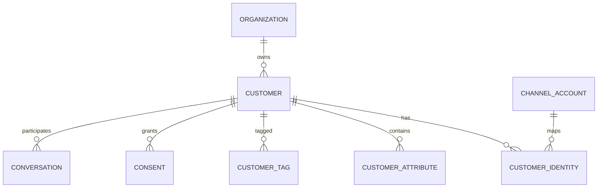
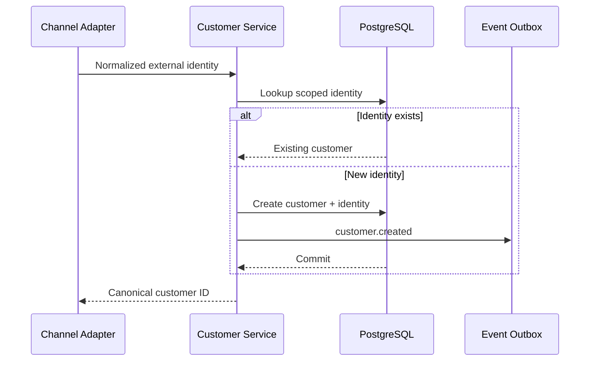
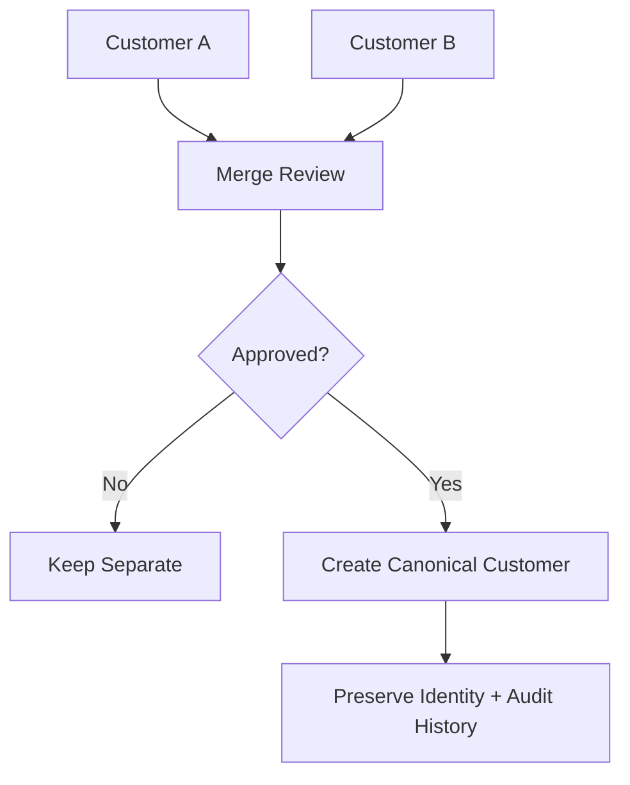
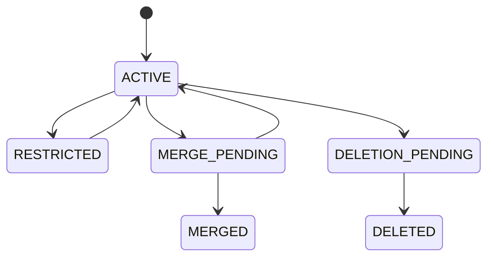

# Customer Domain

> Status: **Target production domain contract**
>
> Customer data is the canonical identity layer connecting people to conversations across channels.

## 1. Domain Responsibility

The Customer domain owns:

- canonical customer identity;
- external channel identities;
- profile attributes;
- tags/segments;
- consent state;
- identity merge/split operations;
- customer-level lifecycle and data retention metadata.

It does not own conversation messages or workforce assignments.

## 2. Core Model



## 3. Customer vs Identity

`Customer` is the canonical person/business-contact record.

`CustomerIdentity` is a provider-specific identity:

```text
WhatsApp:+2010...
Instagram:provider-user-123
Telegram:chat-456
SMS:+2010...
Widget:visitor-uuid
```

One customer may have many identities.

## 4. Identity Uniqueness

An identity should be unique within its provider/account boundary:

```text
(organization_id, channel_provider, channel_account_id, external_identity_id)
```

Do not enforce global uniqueness on phone numbers or social IDs because providers may reuse/namespace them.

## 5. Customer Creation Flow



## 6. Identity Matching

Matching confidence levels:

| Level | Action |
|---|---|
| exact provider identity | deterministic match |
| exact verified customer key | deterministic match if policy allows |
| strong business rule | configurable auto-match |
| ambiguous | do not auto-merge |

LLM-based matching must not silently perform irreversible merges.

## 7. Merge Model

Customer merge is privileged.



The merge operation should preserve:

- source customer IDs;
- identities;
- conversation references;
- audit history;
- merge actor;
- merge reason;
- timestamp.

## 8. Attributes

Customer attributes should distinguish:

- system-managed fields;
- tenant custom attributes;
- derived attributes;
- consented sensitive fields.

Do not create an arbitrary JSON bag for everything if important fields are queried, permissioned, retained, or audited. Important attributes deserve explicit schema.

## 9. Consent

Consent is scoped to a purpose and channel where required.

Example states:

```text
granted
withdrawn
expired
unknown
```

Consent is not equivalent to authorization to access the customer record internally.

## 10. Customer Lifecycle



Deletion must coordinate with conversation, analytics, knowledge feedback, and backup retention rules.

## 11. Cross-Domain Contracts

### Conversations

Conversation references canonical customer identity.

### Channels

Channel adapters resolve provider identities into CustomerIdentity.

### Quality

Quality may use customer/channel dimensions, but evaluation records should not duplicate authoritative customer profile fields unnecessarily.

### Analytics

Customer metrics must be tenant-scoped and privacy-aware.

### AI

AI receives only the customer attributes explicitly allowed by context policy.

## 12. Failure Modes

| Failure | Behavior |
|---|---|
| duplicate provider identity | return existing identity/customer |
| ambiguous identity | create/review according to policy; never silently merge |
| merge conflict | reject until resolved |
| deleted customer referenced by new message | route through retention/recreation policy |
| unauthorized customer lookup | deny without exposing cross-tenant existence |

## 13. Privacy / Retention

Customer profile fields have different retention sensitivity.

PII access and export should be audited. Logs should not reproduce full profiles unnecessarily.

## 14. Acceptance Criteria

- Channel identities map deterministically within tenant/provider scope.
- Ambiguous identity matches do not auto-merge.
- Merge operations preserve history.
- AI cannot retrieve unauthorized customer attributes.
- Customer deletion follows defined downstream retention behavior.
- Customer records never cross organization boundaries.