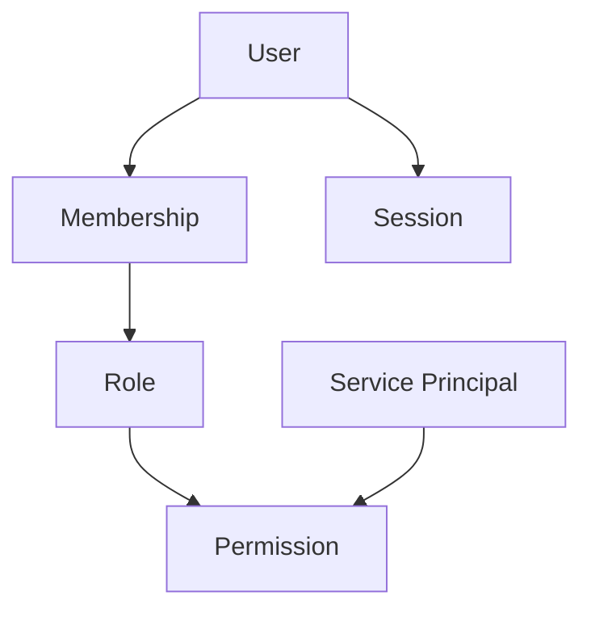

# Identity Domain

> Status: **Target / normative engineering design**. This contract defines the intended business model and implementation rules.

## Purpose

Separate human identity from organization membership and service identities.

## Core Model

User represents a person. Membership represents access to an Organization. Role and Permission define capabilities. ServicePrincipal represents machines such as webhook workers and integration jobs.

## Invariants

- No global User.role decides tenant access.
- Membership changes affect only the organization represented by that membership.
- Service principals are not human users and receive narrow machine permissions.
- Permissions are explicit capabilities; roles are reusable bundles.
- Credential revocation blocks protected operations.

## Operations

- Create/read/update operations are organization-scoped and permission-checked.
- Cross-domain behavior goes through explicit application services or events.
- External identifiers remain provider references and never become authorization keys.
- State changes are observable and auditable where they affect security, money, customer communication, or workflow control.

## Failure and Concurrency

- Validation fails before side effects.
- Concurrent state changes use constraints or explicit version checks.
- Retries are safe only where idempotency is defined.
- External failures produce explicit recoverable states.

## Mermaid Flow

## Change Rule

Changing an invariant or state transition requires updating the relevant requirements, acceptance criteria, tests, API/event contract, and this document.
