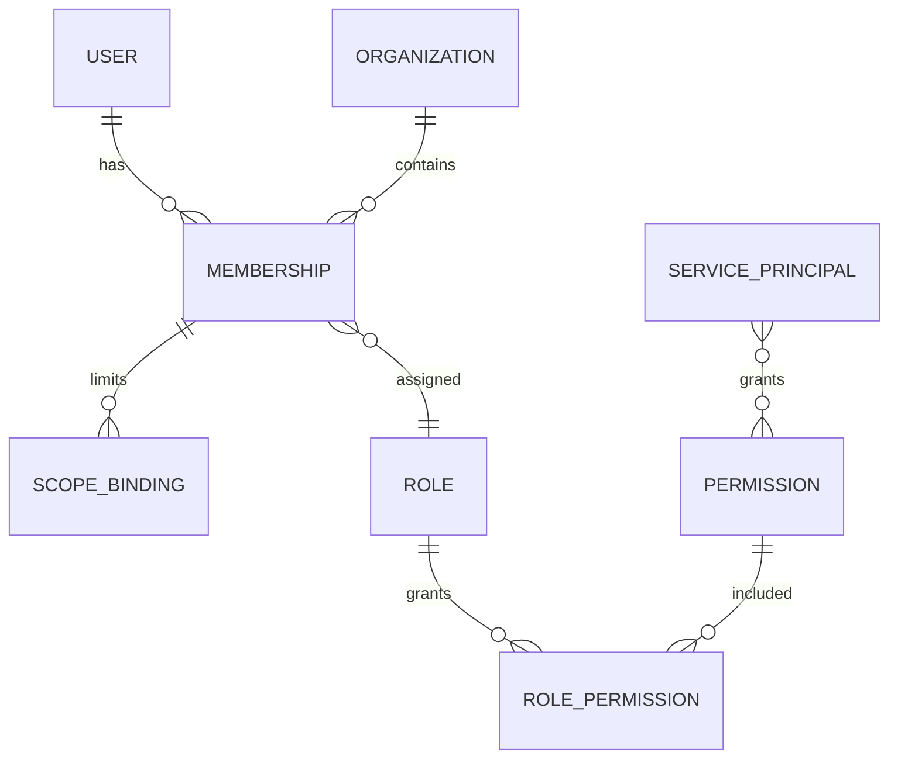
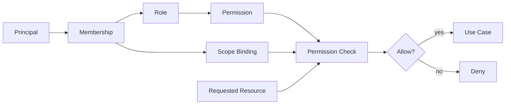
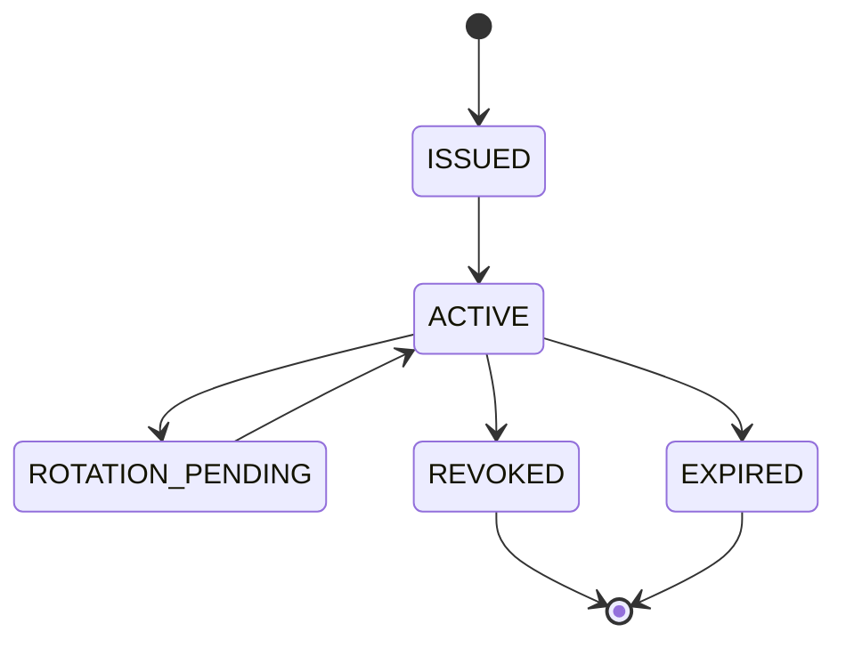

# Identity Domain

> Status: **Target production domain contract**
>
> Identity defines people, machine principals, memberships, roles, permissions, sessions, and credentials.

## 1. Identity vs Access

Identity answers **who is this principal?**

Authorization answers **what may this principal do here?**

OMILINKS must not encode tenant access directly on the global User record.

## 2. Core Entities

| Entity | Purpose |
|---|---|
| User | human identity |
| Membership | relationship between User and Organization |
| Role | reusable permission bundle |
| Permission | atomic capability |
| ScopeBinding | limits permission to client/program/sector/team/site/etc. |
| ServicePrincipal | machine identity |
| Session | authenticated runtime session |
| APIKey | long-lived integration credential |
| Credential | encrypted provider secret reference |

## 3. Membership Model

Conceptual relationship:



A user can belong to multiple organizations with different roles and scopes.

Example:

```text
User Ahmed
  -> Organization A: Admin
  -> Organization B: Supervisor, Team-7 only
```

The second membership must never inherit the first one's access.

## 4. Permissions

Permissions should be expressed as stable capabilities:

```text
customer.read
customer.write
conversation.read
conversation.send
conversation.assign
workforce.manage
ai.configure
ai.execute
tool.execute
billing.read
billing.manage
organization.manage
```

Roles are collections of permissions and are not a substitute for resource-level checks.

## 5. Authorization Decision



Authorization should evaluate:

```text
principal
+ organization
+ permission
+ resource
+ resource ownership
+ effective scope
+ resource state
+ capability policy
```

## 6. Service Principals

Service identities are required for:

- webhook processors;
- background workers;
- scheduled jobs;
- AI runtime;
- integration adapters;
- CI/deployment automation where applicable.

They must not impersonate human administrators unless the operation explicitly defines a delegated identity.

## 7. Sessions

Sessions should contain enough information to identify the principal but not enough authority to bypass current authorization.

Important consequence:

Role changes should become effective without requiring the user to continue using an old authorization snapshot indefinitely.

High-risk administrative actions may require fresh authentication.

## 8. Credential Lifecycle



Credential material is separate from authorization metadata.

## 9. Organization Switching

When a user switches organizations:

1. the client requests the target organization context;
2. the server verifies an active membership;
3. the server resolves effective scopes;
4. all subsequent queries use the new organization context.

The browser cannot switch tenant by changing an ID in local state.

## 10. Privileged Changes

Require stronger controls for:

- owner transfer;
- role/permission policy changes;
- API key creation/revocation;
- provider credential changes;
- billing administrator changes;
- AI tool enablement;
- export permissions.

These changes should generate audit records.

## 11. Failure Modes

| Failure | Behavior |
|---|---|
| invalid credentials | authenticate failure, no domain mutation |
| inactive membership | deny organization access |
| missing permission | deny operation |
| expired credential | require renewal/reauth |
| revoked service identity | reject job/request |
| stale authorization cache | revalidate before high-risk mutation |

## 12. Cross-Domain Contracts

### Tenancy

Membership references organization and scope.

### Workforce

Workforce role is operational; authorization still comes from Membership.

### AI

An AI agent does not inherit all permissions of the human who created it.

### Billing

Billing management is permissioned independently from product usage.

## 13. Audit Model

Capture at minimum:

- actor principal;
- organization;
- action;
- target resource;
- old/new access state where appropriate;
- timestamp;
- correlation ID;
- result.

Do not log raw authentication secrets.

## 14. Acceptance Criteria

- A user can have different access in different organizations.
- A membership scope cannot be widened by client input.
- Service principals have explicit permissions.
- Revoked credentials fail immediately enough for the security requirement.
- AI agents do not inherit human administrator privileges.
- Privileged access changes are auditable.