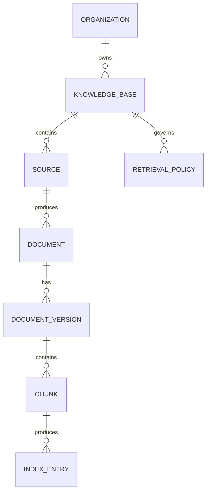
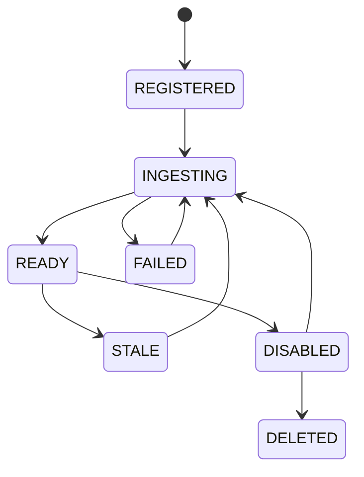
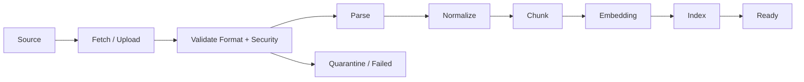
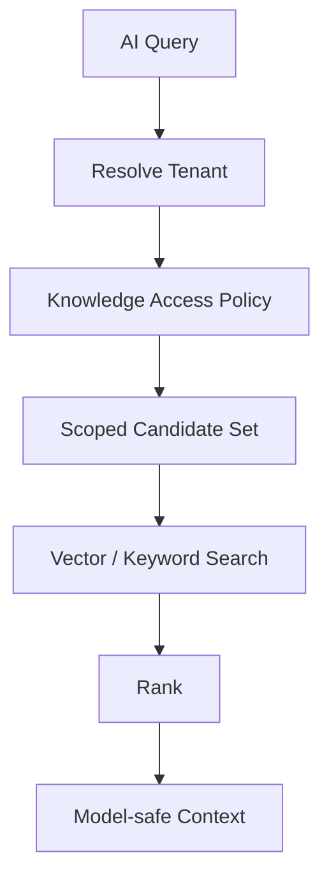
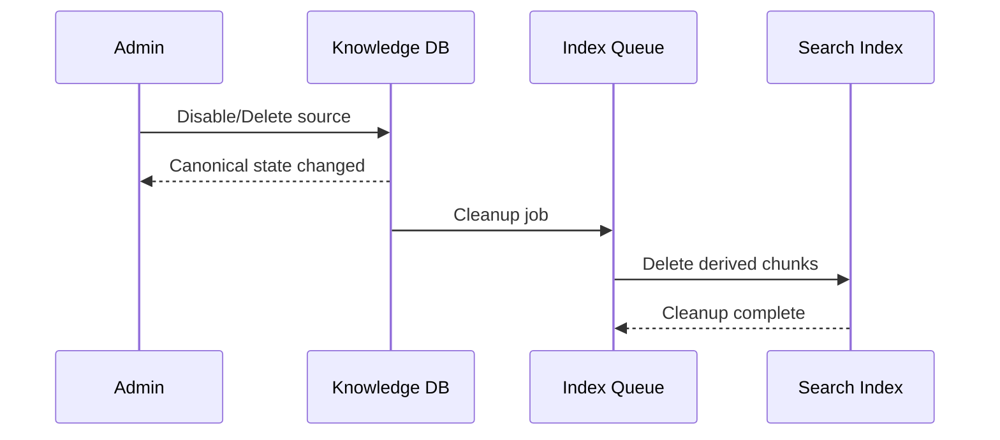

# Knowledge Domain

> Status: **Target production domain contract**

Knowledge is the governed information layer for human and AI operations.

## 1. Source of Truth

Canonical source data lives in transactional/object storage. Search/vector indexes are derived artifacts.

```text
KnowledgeBase
  -> Source
    -> Document
      -> DocumentVersion
        -> Chunk
          -> Embedding/Search Index
```

An index can be rebuilt. The source record remains authoritative.

## 2. Domain Model



## 3. Knowledge Lifecycle



`READY` means the current version passed ingestion/indexing checks, not that the source can never become stale.

## 4. Source Types

- uploaded document
- FAQ/article
- website content
- tenant-authored knowledge
- structured catalog/business data
- external knowledge connector

Every source stores provenance and update strategy.

## 5. Document Versioning

Indexed document versions are immutable:

```text
Billing FAQ
  v1 -> historical
  v2 -> historical
  v3 -> current
```

An AI trace that used v2 must be able to identify v2 later.

## 6. Ingestion Pipeline



All asynchronous ingestion jobs are observable and retryable.

## 7. Chunking

Store organization, knowledge base, document version, source, section/title, chunk order, checksum, and indexing state on chunks.

## 8. Retrieval Authorization

Unsafe:

```text
global vector search
 -> top K
 -> filter unauthorized rows
```

Preferred:

```text
resolve tenant/scope
 -> restrict candidate knowledge
 -> search
 -> rank
 -> project into model context
```



Authorization must hold even if stale index entries remain.

## 9. Deterministic Business Truth

| Need | Preferred mechanism |
|---|---|
| current order status | business API/tool |
| current account balance | business API/tool |
| policy document | knowledge retrieval |
| FAQ | knowledge retrieval |
| product description | knowledge/structured catalog |

Do not force current transactional facts through RAG when a deterministic tool exists.

## 10. Retrieval Result Contract

Return chunk ID, document version, source ID, title/section, relevance metadata, effective scope, and retrieval timestamp.

## 11. Freshness

Track `fresh`, `stale`, `syncing`, `failed`, and `disabled`. Critical workflows should avoid silently using stale knowledge when current business truth is available.

## 12. Deletion

Deletion is canonical first, derived second.



Until cleanup completes, canonical disabled/deleted state must block retrieval.

## 13. Sensitive Knowledge

Knowledge visibility may be organization, client-account, program, sector, team, or site scoped. An AI agent may have a narrower context policy than the requesting human.

## 14. Cross-Domain Contracts

**Tenancy:** ownership/scope.
**AI:** context policy controls retrieval.
**Tools:** live structured facts use deterministic tools.
**Data:** retention/deletion propagates.
**Quality:** source/version IDs support grounding evaluation.

## 15. Failure Modes

| Failure | Behavior |
|---|---|
| parse failure | mark version failed |
| embedding outage | retry job |
| index outage | retrieval degraded |
| stale index after deletion | canonical policy blocks result |
| no authorized knowledge | return empty context |
| stale knowledge for critical task | use tool or handoff |

## 16. Observability

Measure ingestion latency, failures, stale count, index lag, retrieval latency, zero-result rate, source usage, and grounding failure rate.

## 17. Acceptance Criteria

- Source content is separate from derived indexes.
- Every chunk is tenant/scope/provenance aware.
- Authorization filters before model exposure.
- Deleted content is blocked before index cleanup completes.
- Historical traces identify source versions.
- Live business facts use deterministic tools where appropriate.