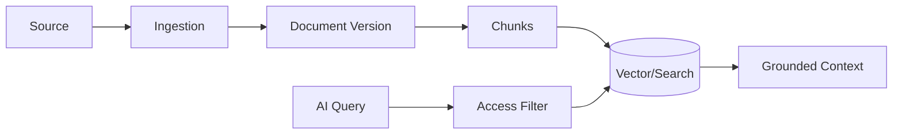

# Knowledge Domain

> Status: **Target / normative engineering design**. This contract defines the intended business model and implementation rules.

## Purpose

Deliver tenant-scoped retrieval with provenance and versioning.

## Core Model

KnowledgeBase -> Source -> Document -> DocumentVersion -> Chunk -> Index. RetrievalPolicy controls accessible knowledge and filters by tenant/scope before ranking.

## Invariants

- Source documents are canonical; indexes are derived.
- Every chunk retains document/version provenance.
- Access filtering happens before similarity ranking can expose content.
- Deleted or disabled sources are removed from retrieval after index convergence.
- Ingestion and indexing are observable asynchronous jobs.

## Operations

- Create/read/update operations are organization-scoped and permission-checked.
- Cross-domain behavior goes through explicit application services or events.
- External identifiers remain provider references and never become authorization keys.
- State changes are observable and auditable where they affect security, money, customer communication, or workflow control.

## Failure and Concurrency

- Validation fails before side effects.
- Concurrent state changes use constraints or explicit version checks.
- Retries are safe only where idempotency is defined.
- External failures produce explicit recoverable states.

## Mermaid Flow

## Change Rule

Changing an invariant or state transition requires updating the relevant requirements, acceptance criteria, tests, API/event contract, and this document.
