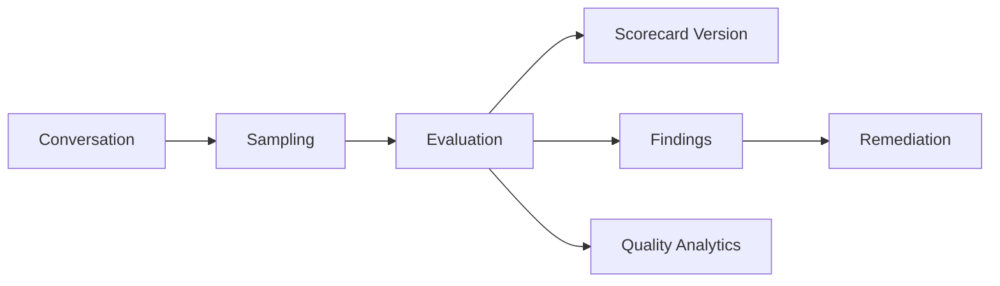

# Quality Domain

> Status: **Target / normative engineering design**. This contract defines the intended business model and implementation rules.

## Purpose

Measure operational quality across conversations, workforce, programs, and AI.

## Core Model

QualityProgram -> Scorecard -> Criterion. Evaluation records reviewer, evidence, score, findings, and remediation references.

## Invariants

- Scorecard versions are immutable once used by completed evaluations.
- Reviewers evaluate only inside allowed organization/scope.
- Scores preserve evidence references.
- AI-generated evaluations are proposals until accepted by policy.
- Quality analytics do not mutate source conversation facts.

## Operations

- Create/read/update operations are organization-scoped and permission-checked.
- Cross-domain behavior goes through explicit application services or events.
- External identifiers remain provider references and never become authorization keys.
- State changes are observable and auditable where they affect security, money, customer communication, or workflow control.

## Failure and Concurrency

- Validation fails before side effects.
- Concurrent state changes use constraints or explicit version checks.
- Retries are safe only where idempotency is defined.
- External failures produce explicit recoverable states.

## Mermaid Flow

## Change Rule

Changing an invariant or state transition requires updating the relevant requirements, acceptance criteria, tests, API/event contract, and this document.
