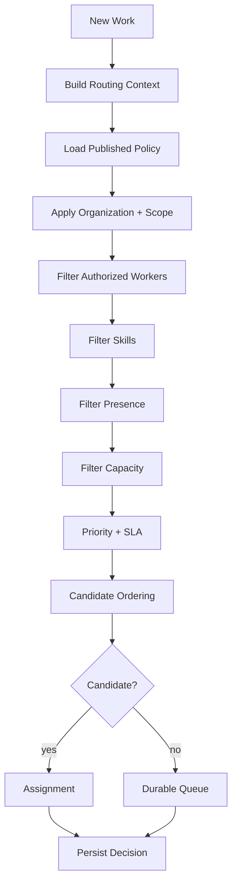
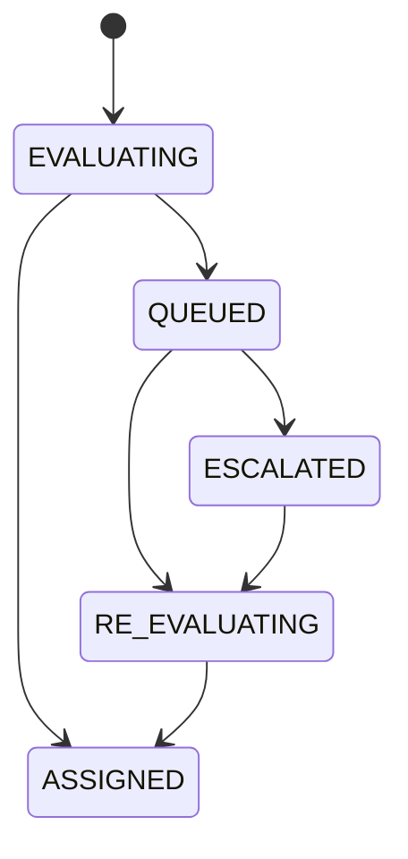

# Routing Domain

> Status: **Target production domain contract**

Routing determines who should own a new or re-routed work item, explains why, and defines what happens when nobody qualifies.

Routing is **not authorization**. It can select only from workers that are already permitted to work in the requested scope.

## 1. Routing Inputs

Potential inputs:

- channel;
- customer/client;
- client account;
- program;
- sector;
- team;
- language;
- skills;
- priority;
- SLA deadline;
- conversation state;
- workforce presence;
- workforce capacity;
- previous assignment;
- AI/human policy.

## 2. Core Entities

| Entity | Responsibility |
|---|---|
| RoutingPolicy | versioned set of rules |
| RoutingRule | ordered condition/action |
| RoutingDecision | immutable decision evidence |
| Queue | durable work fallback |
| SkillRequirement | required capability |
| CandidateSnapshot | worker state used in decision |
| SLAPolicy | urgency/deadline semantics |

## 3. Routing Pipeline



## 4. Hard Filters

A candidate is removed before scoring when:

- outside tenant scope;
- lacks required resource authorization;
- outside valid program/sector/team scope;
- missing required skill;
- disabled;
- offline beyond freshness threshold;
- over capacity;
- blocked by AI/human policy.

A scoring rule must never re-add a candidate removed by a hard constraint.

## 5. Determinism

Routing should produce the same result for the same:

- policy version;
- routing context;
- candidate snapshot.

Dynamic state is acceptable, but the decision record must capture enough evidence to explain which state was observed.

## 6. Policy Versioning

Published policies are immutable.

```text
routing-policy-v3 = published
routing-policy-v4 = draft
```

Historical assignments keep the published version that produced them.

## 7. Scoring

After hard filters, policy may rank candidates using:

- skill match;
- SLA urgency;
- queue priority;
- load balance;
- affinity;
- deterministic tie-breaker.

Conceptual score:

```text
score =
  skill_weight * skill_match
+ urgency_weight * urgency
+ load_weight * inverse_load
+ affinity_weight * affinity
```

Weight values belong to configuration and must be versioned.

## 8. Decision Evidence

A routing decision should contain:

```json
{
  "policyVersion": "routing-v4",
  "matchedRules": [
    "arabic-language",
    "billing-skill",
    "enterprise-priority"
  ],
  "candidateCount": 8,
  "selectedQueue": "enterprise-billing",
  "selectedWorkforceMember": "agent-42"
}
```

The exact internal schema can evolve, but the decision must remain explainable.

## 9. Queue and Escalation



Queue state should carry an SLA deadline so old work cannot disappear into an indefinite backlog.

## 10. Re-Routing

Re-routing triggers include:

- worker becomes unavailable;
- queue overload;
- SLA warning;
- customer escalation;
- AI handoff;
- supervisor override;
- skill/policy change.

Close the previous active assignment instead of mutating history.

## 11. Manual Override

Supervisor override is a permissioned operation.

It records:

- actor;
- previous assignment;
- replacement assignment;
- reason;
- timestamp.

Manual assignment should not silently disable policy unless a documented control policy says so.

## 12. Cross-Domain Contracts

**Tenancy:** supplies organization/scope.

**Workforce:** supplies candidate capabilities and state.

**Conversations:** supplies work context and receives assignment/control.

**AI:** creates routing requests during handoff.

**Quality:** consumes routing/assignment outcomes for operational analytics.

## 13. Failure Modes

| Failure | Behavior |
|---|---|
| policy unavailable | use safe queue/degraded routing policy |
| policy invalid | reject publication, retain last valid version |
| stale worker state | exclude candidate |
| concurrent assignment | conflict + fresh evaluation |
| no eligible candidate | queue |
| SLA threshold reached | escalation |

## 14. Observability

Track:

- routing latency;
- candidate counts;
- hard-filter reasons;
- queue rate;
- reroute rate;
- SLA breach rate;
- policy version usage;
- manual override rate.

## 15. Acceptance Criteria

- Routing never grants permission.
- Hard authorization/scope filters happen before scoring.
- Published routing versions are immutable.
- Decisions retain policy and reason evidence.
- No-match work enters durable state.
- Re-routing preserves assignment history.
- Policy defects cannot silently replace the last valid published policy.