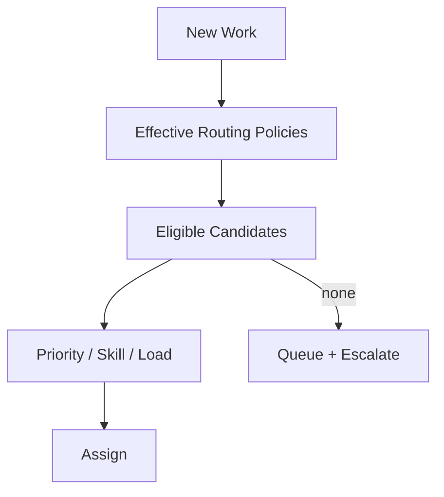

# Routing Domain

> Status: **Target / normative engineering design**. This contract defines the intended business model and implementation rules.

## Purpose

Choose the next responsible queue or workforce member using deterministic, testable policy.

## Core Model

RoutingPolicy contains ordered RoutingRules. Candidate selection uses queue, skills, scope, availability, priority, SLA, and configured scoring.

## Invariants

- Routing considers only policies effective for the tenant and requested scope.
- Rule order and tie-breaking are deterministic.
- Routing never grants access.
- If nobody is eligible, work enters a durable queue state.
- Decision records contain policy version and reason.

## Operations

- Create/read/update operations are organization-scoped and permission-checked.
- Cross-domain behavior goes through explicit application services or events.
- External identifiers remain provider references and never become authorization keys.
- State changes are observable and auditable where they affect security, money, customer communication, or workflow control.

## Failure and Concurrency

- Validation fails before side effects.
- Concurrent state changes use constraints or explicit version checks.
- Retries are safe only where idempotency is defined.
- External failures produce explicit recoverable states.

## Mermaid Flow

## Change Rule

Changing an invariant or state transition requires updating the relevant requirements, acceptance criteria, tests, API/event contract, and this document.
