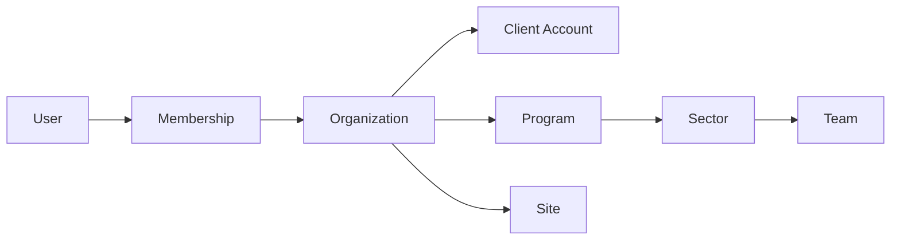

# Tenancy Domain

> Status: **Target / normative engineering design**. This contract defines the intended business model and implementation rules.

## Purpose

Organization is the hard tenant boundary. The hierarchy supports both direct businesses and BPOs without forcing every customer through a BPO-only abstraction.

## Core Model

Organization -> optional ClientAccount -> Program -> Sector -> Team, with Site and Membership scoped under Organization. Resources store organization ownership explicitly.

## Invariants

- Every tenant-owned record belongs to exactly one Organization.
- ClientAccount is optional and never replaces Organization as the security boundary.
- Programs, Sectors, Teams, and Sites constrain scope; they never bypass organization authorization.
- Membership is the link between User and Organization and may include scope bindings.
- Organization lifecycle is explicit: provisioning, active, suspended, closed.

## Operations

- Create/read/update operations are organization-scoped and permission-checked.
- Cross-domain behavior goes through explicit application services or events.
- External identifiers remain provider references and never become authorization keys.
- State changes are observable and auditable where they affect security, money, customer communication, or workflow control.

## Failure and Concurrency

- Validation fails before side effects.
- Concurrent state changes use constraints or explicit version checks.
- Retries are safe only where idempotency is defined.
- External failures produce explicit recoverable states.

## Mermaid Flow

## Change Rule

Changing an invariant or state transition requires updating the relevant requirements, acceptance criteria, tests, API/event contract, and this document.
