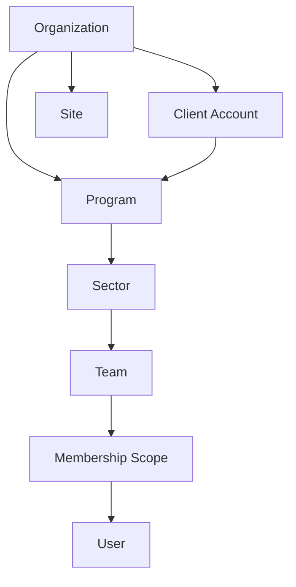
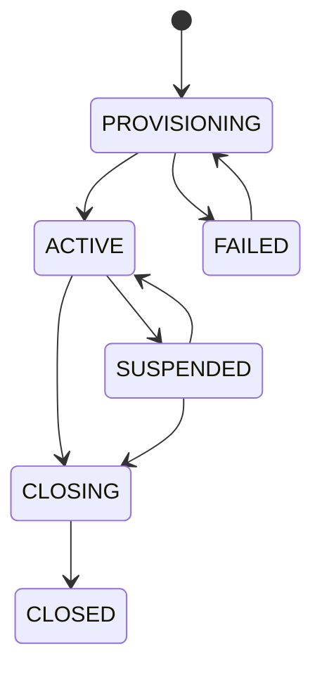

# Tenancy Domain

> Status: **Target production domain contract**
>
> The tenancy model is the root of authorization, data isolation, billing ownership, reporting scope, and BPO hierarchy.

## 1. Domain Responsibility

The tenancy domain answers:

- Which organization owns a resource?
- Which organizational scope contains that resource?
- Which users/services are members?
- Which client/program/sector/team/site does a user or workload operate within?
- What lifecycle state is the organization in?

The domain does **not** decide individual API permissions; identity/authorization consumes its membership and scope model.

## 2. Business Model

OMILINKS must support two operating modes without two separate architectures:

### Direct business

`Organization -> Program/Sector/Team -> Workforce -> Customer Operations`

### BPO/service provider

`Organization -> ClientAccount -> Program -> Sector -> Team -> Workforce -> Customer Operations`

`ClientAccount` is optional. It represents a client served by the operating organization; it is not a tenant/security boundary.

## 3. Core Entities

| Entity | Responsibility | Ownership |
|---|---|---|
| Organization | hard tenant boundary | root |
| ClientAccount | external client served by BPO | Organization |
| Program | operational service/program | Organization, optionally ClientAccount |
| Sector | business partition under a program | Organization |
| Team | workforce operating unit | Organization |
| Site | physical/logical operating location | Organization |
| Membership | user access to organization/scopes | Organization |
| OrganizationSettings | tenant-level configuration | Organization |
| TenantQuota | effective capacity/plan limits | Organization |

## 4. Ownership Invariant

Every tenant-owned row must have an unambiguous ownership path.

Preferred pattern:

```text
resource.organization_id -> organization.id
```

Do not infer ownership through multiple nullable relations during authorization.

If a child has a natural parent such as `Team -> Sector -> Program`, it may also retain `organization_id` when that makes tenant predicates and row-level security safer. The application must enforce consistency between the direct organization ID and parent ownership.

## 5. Hierarchy



The hierarchy represents organizational scope. It must not become an accidental permission hierarchy where child objects automatically grant access.

## 6. Organization Lifecycle



### Provisioning

An organization is not usable until mandatory defaults exist:

- owner membership;
- initial site if the product requires one;
- billing/subscription state;
- default configuration;
- required authorization roles.

Provisioning must be idempotent so repeated signup requests cannot create duplicate tenants.

## 7. BPO Client Boundary

`ClientAccount` exists to model the commercial/operational client relationship.

It may own:

- programs;
- client-facing configuration;
- SLA definitions;
- reporting scope;
- client-specific knowledge;
- approved integrations;
- routing rules.

It does not replace `Organization` in any database ownership or authorization query.

## 8. Scope Model

Effective scope can be:

```text
organization
client_account
program
sector
team
site
```

Scopes are additive constraints. A membership with team scope does not automatically gain organization-wide access.

## 9. Cross-Domain Contracts

### Identity

Identity creates and manages Membership records against organizations and scopes.

### Workforce

Teams and sites provide workforce placement and routing scope.

### Billing

Organization owns subscription, entitlement, and usage.

### Integrations

Channel/provider accounts belong to an organization and may additionally be constrained to client/program scope.

### Analytics

Every tenant-owned metric must retain organization identity and any valid subordinate scope.

## 10. Critical Queries

All of these must be tenant-scoped:

- list organizations available to a user;
- list memberships;
- resolve a team;
- list conversations for a program;
- export customers;
- retrieve usage;
- retrieve AI traces;
- retrieve quality evaluations.

The same object ID must not be queried globally and filtered afterward.

## 11. Concurrency

Organization provisioning requires an idempotency key or unique identity constraint for the initiating signup flow.

Hierarchy operations must reject stale parent versions if the product allows concurrent administrative editing.

Deletion/closure is a lifecycle workflow rather than a direct cascade from the UI.

## 12. Failure Modes

| Failure | Required behavior |
|---|---|
| duplicate signup | return existing provisioning outcome or deterministic conflict |
| missing owner membership | provisioning fails; tenant remains unusable |
| invalid parent scope | reject before mutation |
| closed organization request | deny new business writes |
| suspended organization | apply capability-specific suspension policy |
| cross-tenant ID | return authorization-safe not-found/forbidden result |

## 13. Tenant Isolation Rule

`organization_id` is not a convenience field. It is the fundamental data-isolation key.

Every repository method handling tenant-owned state should make organization context explicit.

```text
repository.getCustomer({ organizationId, customerId })
```

is preferred to:

```text
repository.getCustomer(customerId)
```

## 14. Audit Requirements

Audit tenant lifecycle and hierarchy changes:

- organization created/closed/suspended;
- owner transferred;
- membership scope changed;
- client/program/sector/team created or moved;
- site configuration changed;
- tenant quota/entitlement override changed.

## 15. Acceptance Criteria

- A resource from Organization A is inaccessible from Organization B.
- ClientAccount does not create a second security boundary.
- Scope changes cannot silently broaden permissions.
- Provisioning is repeat-safe.
- Closed organizations cannot perform normal business writes.
- Tenant ownership is queryable without walking an unbounded parent chain.
- Hierarchy and membership changes are auditable.