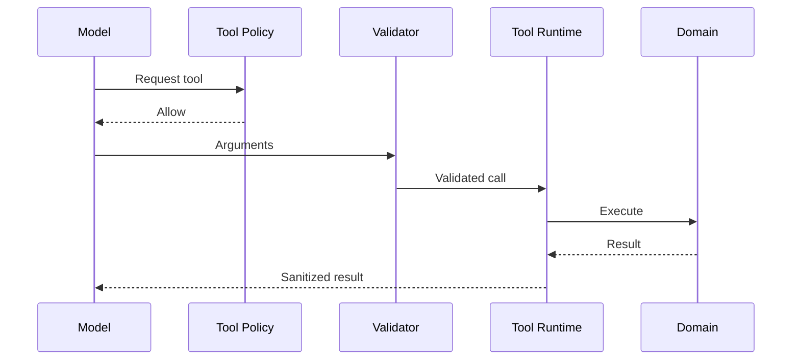

# Tools Domain

> Status: **Target / normative engineering design**. This contract defines the intended business model and implementation rules.

## Purpose

Expose auditable, permissioned business capabilities to AI agents and workflows.

## Core Model

ToolDefinition -> ToolVersion -> ToolPolicy. Each ToolInvocation references the caller, arguments, authorization result, credential reference, outcome, and idempotency key when relevant.

## Invariants

- Only registered active tools can execute.
- Arguments are runtime-validated against a versioned schema.
- Side-effecting tools define idempotency, timeout, retry, and compensation behavior.
- Credentials are referenced server-side and never shown to the model.
- High-risk tools can require durable human approval.

## Operations

- Create/read/update operations are organization-scoped and permission-checked.
- Cross-domain behavior goes through explicit application services or events.
- External identifiers remain provider references and never become authorization keys.
- State changes are observable and auditable where they affect security, money, customer communication, or workflow control.

## Failure and Concurrency

- Validation fails before side effects.
- Concurrent state changes use constraints or explicit version checks.
- Retries are safe only where idempotency is defined.
- External failures produce explicit recoverable states.

## Mermaid Flow

## Change Rule

Changing an invariant or state transition requires updating the relevant requirements, acceptance criteria, tests, API/event contract, and this document.
