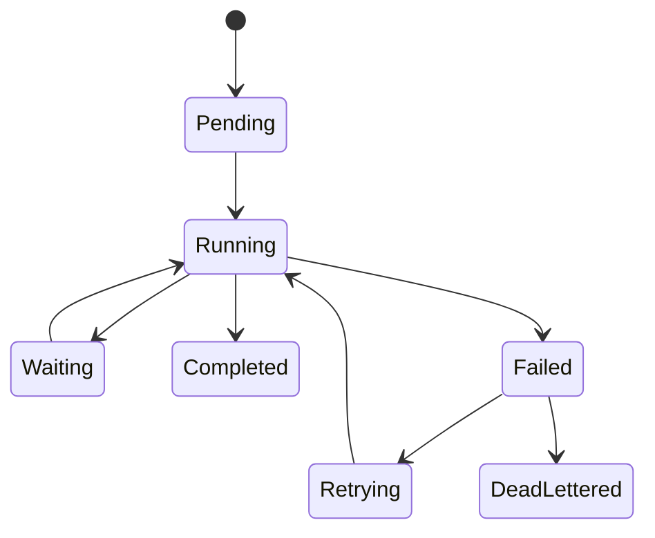

# Workflow Domain

> Status: **Target / normative engineering design**. This contract defines the intended business model and implementation rules.

## Purpose

Run durable automation as explicit state machines rather than UI-only sequences.

## Core Model

WorkflowDefinition has immutable WorkflowVersions. WorkflowRun executes versioned Steps/StepRuns with Trigger, Timer, Variable, RetryState, and optional Approval.

## Invariants

- Published workflow versions are immutable.
- Every run references exactly one version.
- Side-effecting steps define idempotency.
- Retries are bounded and persisted.
- Human approval is a durable workflow state.

## Operations

- Create/read/update operations are organization-scoped and permission-checked.
- Cross-domain behavior goes through explicit application services or events.
- External identifiers remain provider references and never become authorization keys.
- State changes are observable and auditable where they affect security, money, customer communication, or workflow control.

## Failure and Concurrency

- Validation fails before side effects.
- Concurrent state changes use constraints or explicit version checks.
- Retries are safe only where idempotency is defined.
- External failures produce explicit recoverable states.

## Mermaid Flow

## Change Rule

Changing an invariant or state transition requires updating the relevant requirements, acceptance criteria, tests, API/event contract, and this document.
