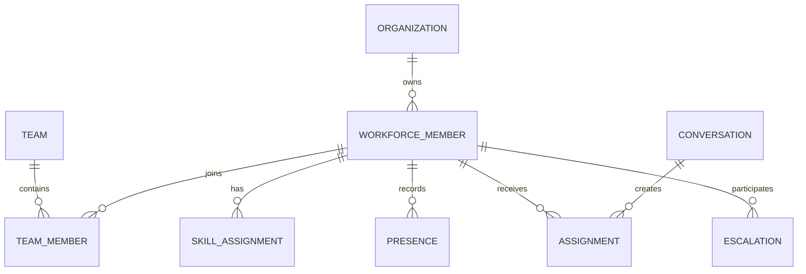
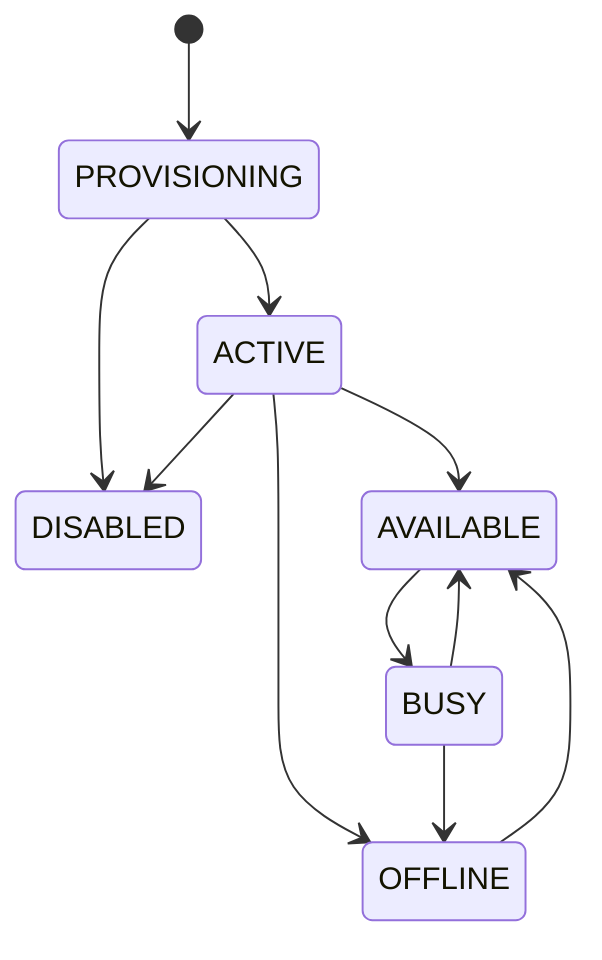
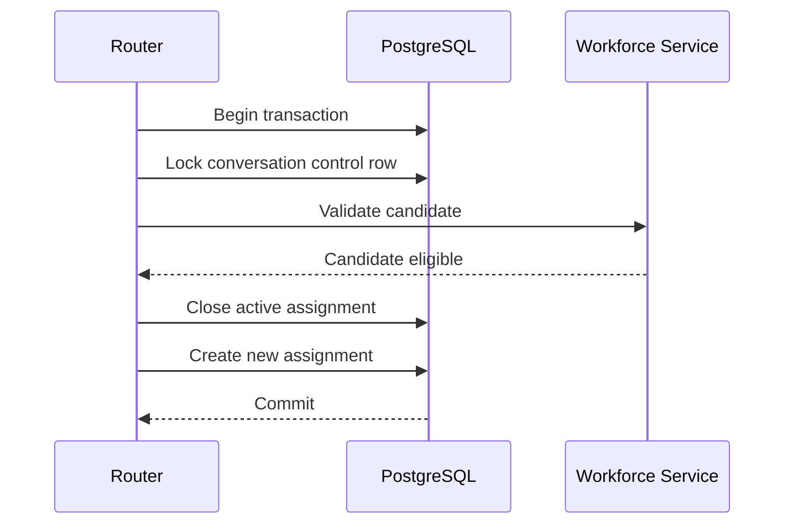

# Workforce Domain

> Status: **Target production domain contract**

The workforce domain models the people and AI units that perform customer operations. It owns capability, presence, capacity, assignment and handoff semantics. Authorization remains a separate concern.

## 1. Core Concepts

`WorkforceMember` is the common operational abstraction with two major forms:

- `HumanAgent`
- `AIAgent`

Shared routing concepts include skills, queues, team membership, presence and capacity. Execution policy differs between humans and AI.

## 2. Domain Model

## 3. Lifecycle vs Presence

Do not overload one status field.

`lifecycle_state` describes whether the worker can participate in work at all:

`provisioning -> active -> disabled`

`presence_state` describes current availability:

`offline -> available -> busy -> offline`

Presence is volatile and should have a freshness/heartbeat rule.

## 4. Skills

Skills describe capability, not permission.

Examples:

- Arabic;
- English;
- billing;
- technical support;
- retention;
- product-specific expertise.

A skill can be attached to a worker with a proficiency/rating if the routing system needs it.

An agent with `billing` skill can still be forbidden from a particular customer by authorization scope.

## 5. Capacity

Capacity is the workload budget of a worker.

Human examples:

`max_active_conversations`, `reserved_capacity`, `current_load`

AI examples:

`max_concurrent_runs`, `token_budget`, `provider_concurrency`

Capacity affects routing. It must never be treated as a security control.

## 6. Assignment Model

Assignments are historical business records.

| Field | Meaning |
|---|---|
| assignment_id | unique assignment |
| conversation_id | work item |
| workforce_member_id | assignee |
| queue/team | operational scope |
| state | active/released/completed |
| assigned_at | start |
| released_at | end |
| assigned_by | actor |
| reason | manual/routing/escalation |
| routing_decision_id | decision evidence |

Do not rely only on `conversation.assignee_id`; that loses history and makes auditing difficult.

## 7. Assignment Concurrency

Assignment is a concurrency-sensitive mutation.

If another worker wins the same assignment race, the losing operation should retry from fresh state rather than overwrite the winner.

## 8. Human Handoff

Handoff transfers conversation control.

A handoff records:

- source controller;
- destination worker/queue;
- reason code;
- trigger;
- control version;
- SLA effect;
- timestamp;
- optional recommended next action.

After handoff, autonomous AI continuation must be cancelled or invalidated.

## 9. Queue Model

A queue is durable waiting work.

Queue records should expose:

- queue id;
- organization/scope;
- priority;
- SLA deadline;
- required skills;
- current age;
- assignment attempts;
- escalation state.

A queue is not an error sink. It is a first-class operational state.

## 10. Scheduling

Distinguish:

- schedule = planned availability;
- presence = observed availability;
- capacity = allowed workload.

Routing may consider all three.

## 11. Cross-Domain Contracts

**Tenancy:** workers belong to an organization and valid scopes.

**Routing:** routing reads skills/presence/capacity and creates assignments.

**Conversations:** assignments change conversation ownership/control.

**AI:** AIAgent configuration points to AI policy while runtime handles execution.

**Quality:** quality aggregates results by worker/team without changing workforce history.

## 12. Failure Modes

| Failure | Required behavior |
|---|---|
| disabled worker with active work | re-route or queue |
| stale presence | exclude from new work |
| capacity exceeded | exclude candidate |
| assignment race | transactional conflict/re-evaluation |
| no eligible candidate | queue + escalation policy |
| handoff destination unavailable | queue safely, do not drop conversation |

## 13. Observability

Measure:

- assignment latency;
- queue depth;
- oldest queued work;
- utilization;
- presence freshness;
- handoff rate;
- reassignment rate;
- SLA breaches.

## 14. Acceptance Criteria

- Human and AI workers participate in the same operational assignment model.
- Presence cannot grant authorization.
- Concurrent assignments cannot create conflicting active ownership.
- Disabled workers do not receive new work.
- Unroutable work is durable.
- Handoff invalidates stale AI control.
- Assignment history is auditable.