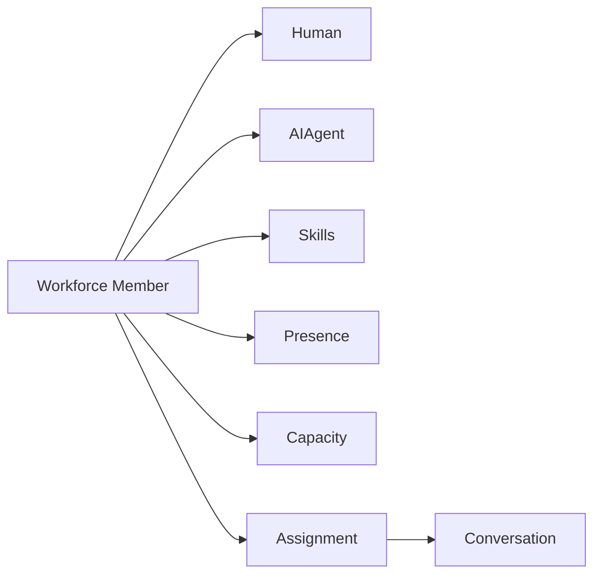

# Workforce Domain

> Status: **Target / normative engineering design**. This contract defines the intended business model and implementation rules.

## Purpose

Treat humans and AI agents as workforce capabilities with shared assignment and capacity semantics.

## Core Model

WorkforceMember is a common abstraction with HumanAgent and AIAgent specializations. Skills, Presence, Capacity, Team membership, Assignment, and Escalation surround it.

## Invariants

- Presence is operational state, not authorization.
- Assignments are tenant-scoped and concurrency-safe.
- AI and human workforce members expose capability metadata but have different control policies.
- Capacity influences routing but cannot grant forbidden access.
- Handoff state is durable and visible.

## Operations

- Create/read/update operations are organization-scoped and permission-checked.
- Cross-domain behavior goes through explicit application services or events.
- External identifiers remain provider references and never become authorization keys.
- State changes are observable and auditable where they affect security, money, customer communication, or workflow control.

## Failure and Concurrency

- Validation fails before side effects.
- Concurrent state changes use constraints or explicit version checks.
- Retries are safe only where idempotency is defined.
- External failures produce explicit recoverable states.

## Mermaid Flow

## Change Rule

Changing an invariant or state transition requires updating the relevant requirements, acceptance criteria, tests, API/event contract, and this document.
