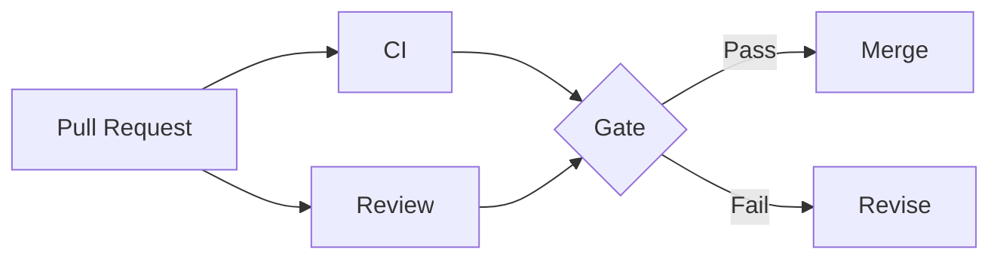

# Pull Request Policy

> Status: **Target / normative engineering design**.

A PR is a reviewable unit of system behavior, not simply a code diff.

## Contract

Review correctness, invariants, tenant isolation, authorization, concurrency/idempotency, API compatibility, observability, tests, documentation, security and provider boundaries. Block PRs with missing critical tests, implicit authorization, leaked provider SDKs, or undocumented breaking changes.

## Mermaid Flow

## Engineering Rule

The design must fail closed on authorization, preserve tenant scope, make retries safe, and expose enough telemetry to diagnose production behavior.
