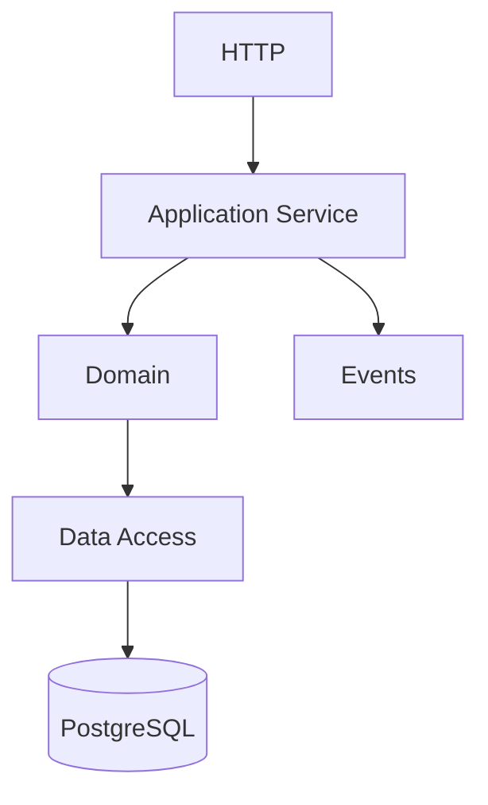

# Coding Standards

> Status: **Target / normative engineering design**.

Code structure must reflect business boundaries rather than infrastructure convenience.

## Contract

Routes/controllers stay thin; domain modules own business rules; provider SDKs stay behind adapters; frontend never accesses databases; strict TypeScript is required; runtime validation is required for untrusted input; errors carry correlation context and never swallow failures.

## Mermaid Flow

## Engineering Rule

The design must fail closed on authorization, preserve tenant scope, make retries safe, and expose enough telemetry to diagnose production behavior.
