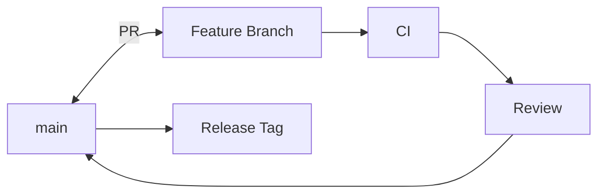

# Git Strategy

> Status: **Target / normative engineering design**.

Keep main releasable and use short-lived focused feature branches.

## Contract

Use conventional commit prefixes such as feat, fix, refactor, docs, test, chore, ci. Never commit secrets or local artifacts. Releases are tagged from the exact deployed commit; hotfixes include regression coverage.

## Mermaid Flow

## Engineering Rule

The design must fail closed on authorization, preserve tenant scope, make retries safe, and expose enough telemetry to diagnose production behavior.
