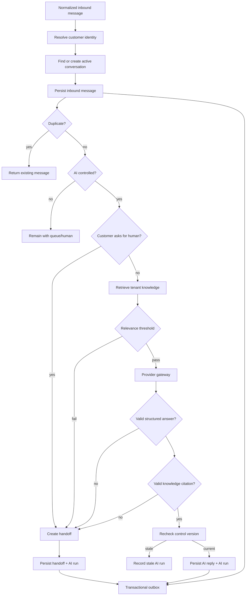
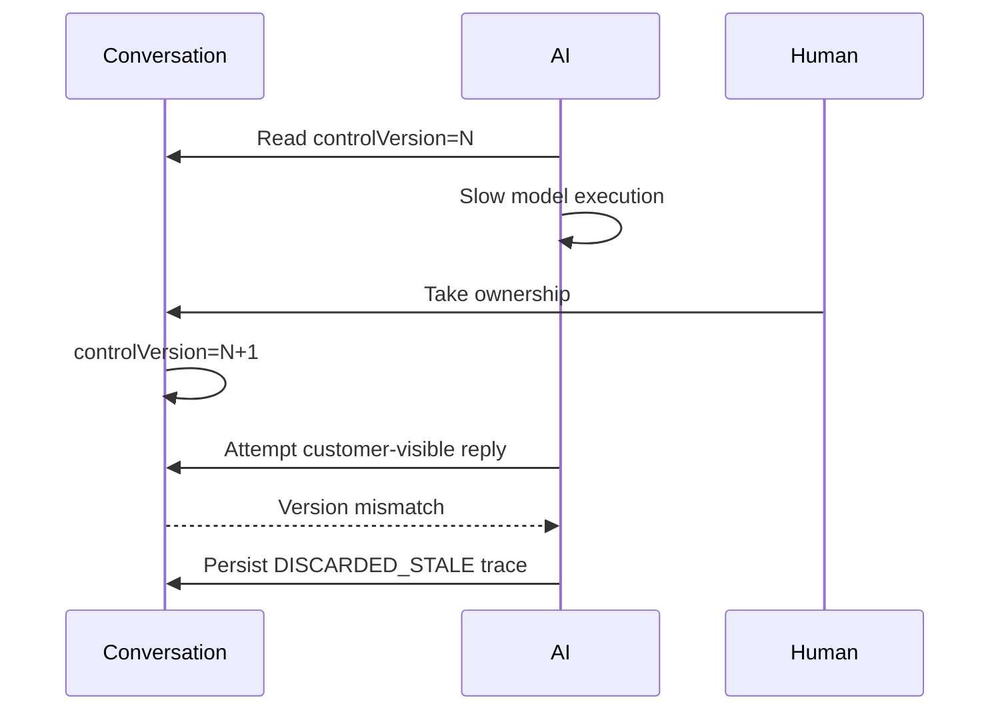

# Phase 2 — Conversation Core + Initial AI Pipeline

> Status: implementation target for completion on this branch
>
> Phase 2 is the last pre-channel slice. It proves that OmniLinks can receive a normalized customer message, maintain canonical conversation state, make a governed AI decision, hand off safely, and leave durable evidence for everything that happened.

## 1. Scope

Phase 2 owns:

1. Customer resolution from a provider identity.
2. Canonical conversation creation/reuse.
3. Canonical inbound message persistence and deduplication.
4. Tenant-scoped knowledge documents/chunks.
5. Deterministic lexical retrieval with a relevance gate.
6. Initial model-provider abstraction.
7. Structured AI response validation.
8. Explicit human-request detection and handoff.
9. AI run traceability.
10. Human-takeover race protection.
11. Transactional outbox records for critical conversation/AI events.
12. Tenant-scoped inspection of AI runs.

Phase 2 does not own live channel adapters, outbound provider delivery, asynchronous workers, advanced RAG, tools, workflow automation, billing, or production identity.

## 2. Canonical flow



## 3. Conversation invariants

### Customer identity

Within one organization and provider-account namespace:

```text
(provider, providerAccountId, externalId)
        -> at most one canonical Customer
```

Concurrent first-seen events must resolve to one customer.

### Active conversation

For one organization/customer/channel combination, there can be at most one live conversation in the active status set.

The PostgreSQL unique partial index is the final concurrency guard; application pre-checks are only an optimization.

### Message deduplication

A provider retry is the same canonical message when its provider identity matches. Client-originated mutations may also use a client message id.

A duplicate message:

- returns the already persisted message;
- creates no second message;
- triggers no second AI run;
- creates no second outbox event.

## 4. AI governance

The initial AI runtime is intentionally narrow:

```text
knowledge
    ↓
relevance gate
    ↓
model
    ↓
strict JSON
    ↓
citation validation
    ↓
control-version validation
    ↓
customer-visible reply
```

The model is never the authorization boundary and cannot write persistence directly.

The AI pipeline can only produce:

```text
ANSWERED
HANDOFF
DISCARDED_STALE
```

## 5. Handoff policy

The initial safe-failure policy is: uncertainty means no invention; hand off instead.

Current reasons:

- CUSTOMER_REQUESTED_HUMAN
- NO_RELEVANT_KNOWLEDGE
- MODEL_COULD_NOT_ANSWER
- UNGROUNDED_ANSWER
- MODEL_OUTPUT_INVALID
- PROVIDER_ERROR

## 6. Control-version race protection



A late AI response is therefore not allowed to overwrite human ownership.

## 7. Knowledge contract

The current retriever is BM25-based and deterministic. It proves the retrieval contract before more expensive retrieval infrastructure is introduced.

```text
Retriever
  ├── current: BM25
  └── future: FTS / embeddings / reranker
```

The current relevance gate uses IDF-weighted query coverage. The threshold must be calibrated against representative tenant data before production AI claims are made.

## 8. Outbox contract

The transactional database writes durable event intent alongside the business mutation.

Current Phase 2 events:

```text
conversation.message.received
conversation.message.sent
conversation.control.changed
conversation.handoff.created
ai.run.completed
```

Each event has a version, tenant id, aggregate identity, correlation identity, optional causation identity, JSON payload, and PENDING initial state.

The publisher is intentionally deferred. Phase 2 proves atomic event intent, not asynchronous delivery.

## 9. Verification

The completion evidence is spread across:

```text
src/pipeline.test.ts
src/ai.test.ts
src/hardening.test.ts
src/postgres.test.ts
src/phase2-completion.test.ts
```

The Phase 2 completion suite specifically verifies durable outbox events, duplicate inbound behavior, handoff event emission, outbox tenant isolation, and authenticated AI-run inspection.

The PostgreSQL variants use the same store-test harness when TEST_DATABASE_URL is available.

## 10. Exit criteria

```text
[✓] canonical customer identity
[✓] canonical conversation
[✓] inbound deduplication
[✓] concurrent first-message protection
[✓] tenant-scoped knowledge
[✓] deterministic retrieval gate
[✓] model adapter contract
[✓] structured output validation
[✓] citation gating
[✓] explicit human handoff
[✓] AI run traceability
[✓] human takeover race protection
[✓] transactional outbox intent
[✓] tenant-isolated AI-run inspection
[✓] negative-path tests
```

## 11. Explicitly deferred

```text
live WhatsApp
live Telegram
live Instagram
live Facebook
SMS
web widget transport
outbound provider delivery
outbox publisher
durable worker runtime
retry/dead-letter infrastructure
embeddings
vector database
reranking
agent tool execution
workflow engine
n8n execution
billing
production identity
production frontend
```

They belong to subsequent phases and should not be smuggled into Phase 2 under different names.