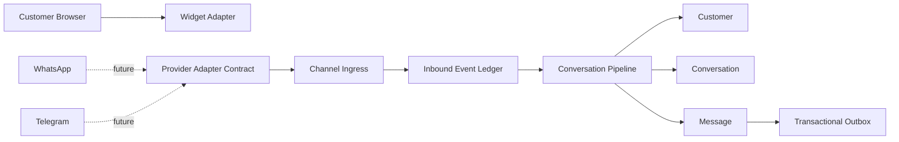
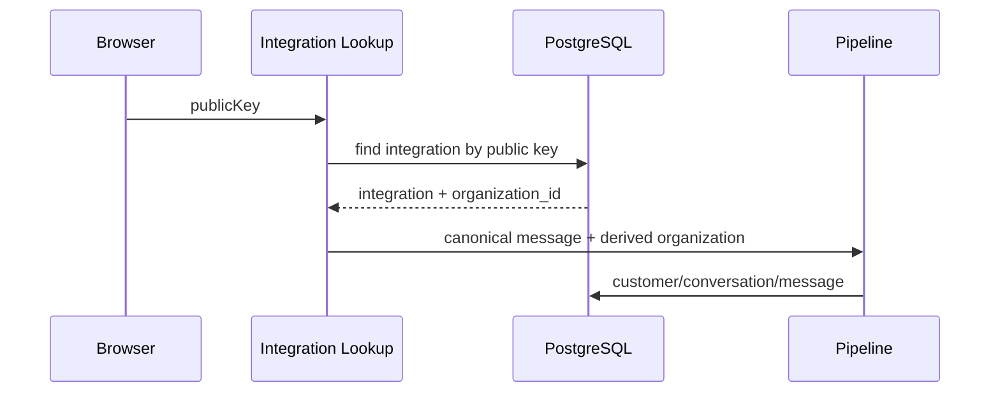
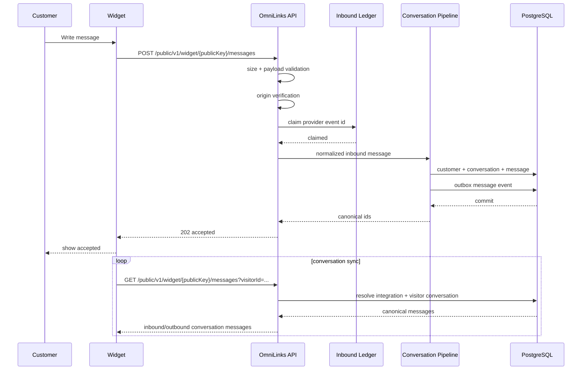
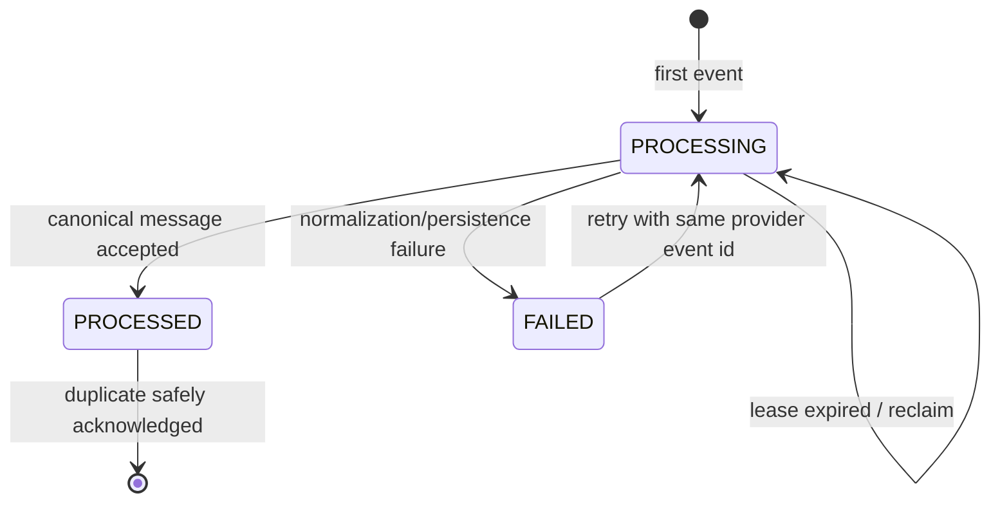
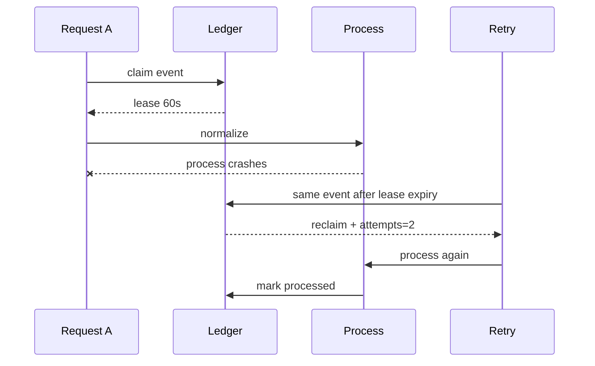
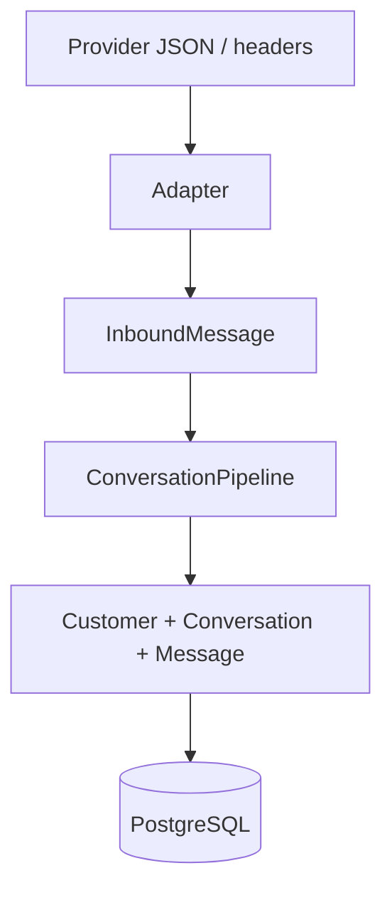

# Phase 3 — Channels + Webhooks

> Status: **implemented vertical slice**
>
> Phase 3 connects an external channel to the canonical OmniLinks conversation core without allowing provider-specific protocol details to leak into domain logic.

## 1. What we are building



The core idea is separation:

```text
provider protocol
      ↓
channel adapter
      ↓
canonical inbound message
      ↓
conversation pipeline
      ↓
customer / conversation / message
```

Changing WhatsApp parsing must not change Customer or Conversation rules.

## 2. Implemented in this phase

- tenant-scoped channel integration configuration;
- publishable widget key;
- allowed-origin policy;
- shared channel adapter contract;
- Web Widget adapter;
- public widget configuration endpoint;
- public widget message endpoint for inbound send and tenant-safe conversation readback;
- inbound provider-event ledger;
- provider-event deduplication before business mutation;
- retryable ingress state with a lease;
- canonical message persistence through the Phase 2 pipeline;
- widget client application;
- integration API for tenant administrators;
- integration and ingress tests for memory and PostgreSQL stores.

Only the **widget** is activated in this phase. WhatsApp/Telegram/etc. remain adapter targets, not falsely-claimed live integrations.

## 3. Tenant binding

The browser is deliberately not allowed to say:

```json
{
  "organizationId": "tenant-A"
}
```

Instead it sends a public integration key:

```text
wk_xxxxxxxxxxxxx
```

The backend performs:



This matters because tenant identity comes from server-controlled integration configuration rather than user input.

## 4. Public widget request



AI inference is intentionally not executed by the public channel endpoint. Phase 3 proves channel acceptance and canonicalization. Durable asynchronous processing is a later event/worker phase.

## 5. Why the inbound ledger exists

Provider retries are normal.

Without an inbound ledger:

```text
provider retry
   ↓
create customer
   ↓
create conversation
   ↓
create message AGAIN
```

With the ledger:



The unique constraint is:

```text
integration_id + provider_event_id
```

That is the first dedupe boundary. Message-level dedupe remains a second defense.

## 6. Lease and crash recovery

A simple unique constraint is not enough when a process crashes after claiming an event.

Each processing record therefore has:

```text
attempts
lease_until
status
last_error
```

Example:



This is intentionally a small Phase 3 mechanism. The later worker runtime will own generalized leases, retry queues and dead letters.

## 7. Adapter contract

The adapter owns external protocol semantics:

```text
ChannelAdapter
├── provider
├── verifyInbound()
└── normalizeInbound()
```

The application owns business semantics:

```text
ConversationPipeline
├── customer resolution
├── active conversation
├── message persistence
├── AI control
├── knowledge
└── handoff
```

Therefore:



## 8. Where you change behavior

| Change you want | Change here | Do not change |
|---|---|---|
| WhatsApp JSON fields changed | `integrations/whatsapp.ts` | ConversationPipeline |
| Telegram update mapping | `integrations/telegram.ts` | Customer model |
| Widget validation | `integrations/web-widget.ts` | Domain rules |
| Tenant/channel lookup | `application/channel-ingress.ts` | Provider parser |
| Customer matching rules | `application/pipeline.ts` / Customer domain | Adapter |
| AI policy | `application/pipeline.ts` / AI module | Channel adapter |
| Outbox event semantics | persistence + event contract | Provider SDK code |
| Origin policy | channel integration configuration | Customer identity |

The goal is to make change locality predictable.

## 9. CORS

The widget is a browser application and is therefore cross-origin by nature.

Phase 3 uses an explicit allowed-origin configuration for server-side admission:

```text
ChannelIntegration.allowedOrigins
        ↓
WebWidgetAdapter.verifyInbound()
        ↓
accepted / rejected
```

The public endpoint does not use browser credentials, so responses expose no tenant session. The public key only identifies a channel integration.

For production hardening, rate limiting, abuse controls and stronger browser/session protections are still required.

## 10. API surface

Authenticated tenant administration:

```text
GET  /api/v1/channels
POST /api/v1/channels
```

Public widget:

```text
GET  /public/v1/widget/{publicKey}/config
GET  /public/v1/widget/{publicKey}/messages?visitorId={visitorId}
POST /public/v1/widget/{publicKey}/messages
OPTIONS /public/v1/widget/{publicKey}/messages
```

Widget message requires a stable idempotency identity:

```text
X-Widget-Message-Id
```

or:

```json
{ "clientMessageId": "stable-id" }
```

## 11. Failure model

| Failure | Behavior |
|---|---|
| unknown public key | 404 |
| disabled integration | 404 |
| degraded integration | 503 |
| wrong provider for adapter | rejected |
| forbidden origin | 403 before mutation |
| malformed message | 400 + FAILED ledger record |
| duplicate provider event | 202 + no second mutation |
| process crash after claim | lease expiry allows retry |
| customer/conversation persistence failure | retry-compatible failure |
| AI unavailable | not part of Phase 3 ingress path |

## 12. Current event semantics

Phase 3 aligns message outbox facts with the event catalog:

```text
inbound  -> conversation.message.received
outbound -> conversation.message.sent
```

This is important for future consumers. A worker consuming `received` can safely assume that the fact is inbound customer traffic.

## 13. Verification

Phase 3 tests cover:

- integration creation and tenant ownership;
- public config without exposing organization identity;
- widget ingress;
- customer and conversation creation through the canonical pipeline;
- event deduplication before business mutation;
- failed normalization and retry with the same event id;
- origin rejection;
- mandatory stable message identity;
- CORS preflight;
- tenant-safe widget conversation readback for AI/human replies;
- tenant isolation through the existing store test harness.

CI also runs PostgreSQL migrations and the full backend test/build gate.

## 14. What is intentionally not here

```text
WhatsApp live credentials
Telegram live credentials
Facebook live credentials
Instagram live credentials
SMS provider credentials
outbound provider sending workers
delivery reconciliation
general retry queues
dead letters
AI workers
vector retrieval
workflow execution
```

Those belong to later phases. This separation is intentional: channel transport should not become a second workflow engine.

## 15. Exit criteria

```text
[✓] provider-independent adapter contract
[✓] tenant-bound channel integration
[✓] public widget key
[✓] origin verification
[✓] inbound provider-event dedupe
[✓] retryable inbound ledger
[✓] canonical message persistence
[✓] canonical received event
[✓] widget client
[✓] tenant-safe widget conversation readback
[✓] authenticated channel management
[✓] negative-path tests
[✓] PostgreSQL migration support
```