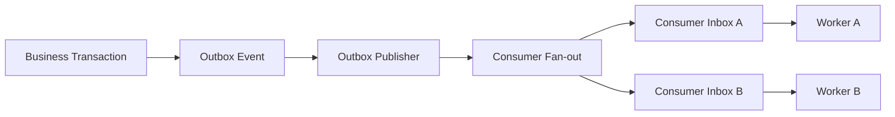
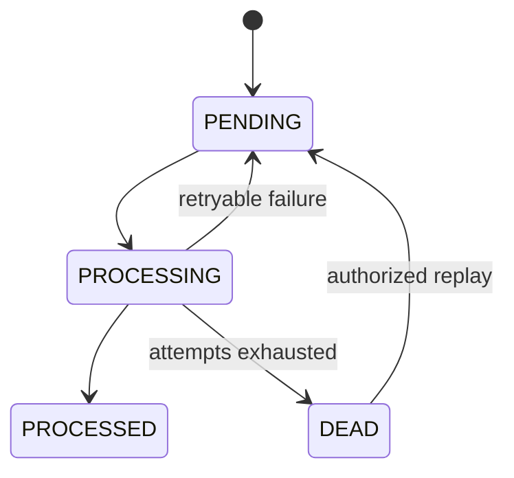
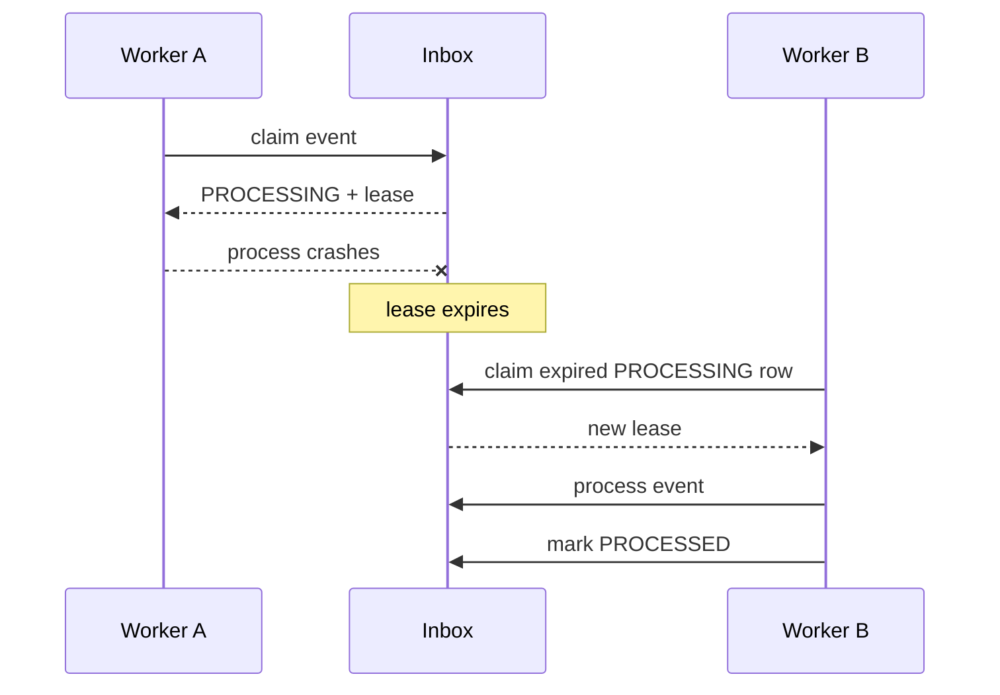
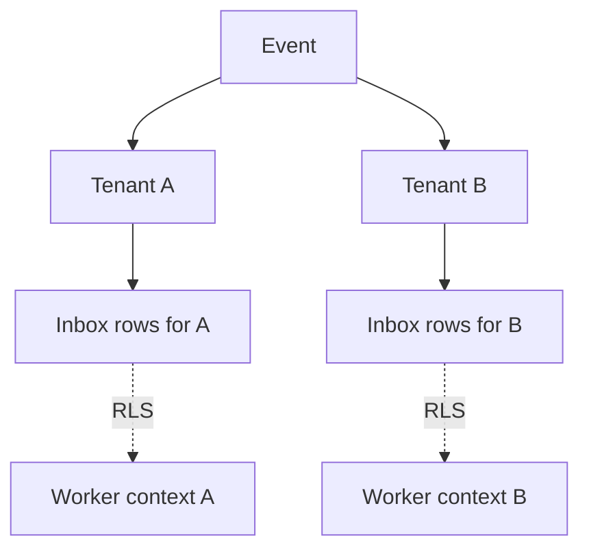
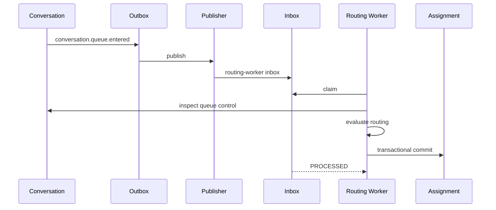

# Phase 5 — Event + Worker Runtime

> Status: Implemented vertical slice

Phase 5 changes OmniLinks from a request-driven backend into a system that can execute durable asynchronous work.

```text
business transaction
  -> outbox event
  -> publisher
  -> per-consumer inbox
  -> worker lease
  -> handler
  -> processed
  -> retry / dead letter / replay
```

## 1. Why the outbox is not the worker queue

`outbox_events` records facts atomically with business state. It must remain the source of truth for what happened.

`event_inbox` is the per-consumer execution state.



One event can therefore be observed by several consumers without mutating the original event record.

## 2. Delivery state machine



An event is only considered completed after the consumer handler succeeds and the inbox row is atomically marked `PROCESSED`.

## 3. Consumer deduplication

An inbox row is unique on:

```text
organization_id + consumer_id + event_id
```

Publishing the same outbox event twice therefore cannot create duplicate work for the same consumer.

Do not move this guarantee into application code alone. The database constraint is the final protection against publisher races.

## 4. Worker leases

Processing rows carry `lease_until` and `leased_by`.



This is the crash-recovery mechanism.

A worker does not need to finish its handler for the database to recover the work. It only needs to stop renewing the lease and let the row become reclaimable.

## 5. Worker process lease

`worker_leases` records live worker instances.

```text
worker_id
worker_class
lease_until
heartbeat_at
metadata
```

The worker runtime acquires a lease when a consumer starts processing and renews it on later polling cycles.

## 6. Retry policy

Handlers can fail without losing the work item.

Current runtime model:

```text
attempt 1 -> retry
attempt 2 -> retry
...
attempt N -> DEAD
```

Retry delay is handler-configurable. The runtime provides exponential backoff helpers.

Dead-letter state retains the error instead of silently dropping the event.

## 7. Replay

Replay resets delivery state:

```text
DEAD
  -> attempts = 0
  -> clear lease
  -> clear error
  -> available immediately
  -> PENDING
```

The original outbox event is unchanged. Replay creates another execution attempt against the same historical event.

## 8. Tenant isolation

`event_inbox` carries `organization_id` and is protected with forced RLS.



`worker_leases` is intentionally global because it represents worker process ownership rather than tenant data.

## 9. Per-class concurrency

Consumers declare a worker class and concurrency limit.

```text
routing worker
  class = routing
  concurrency = 4
```

The runtime also accepts class-level limits so deployment configuration can cap a class without changing individual handlers.

Later classes can include:

```text
routing
ai
workflow
delivery
quality
billing
```

## 10. Correlation propagation

Every `WorkerEventContext` contains:

```text
organization_id
event_id
event_type
correlation_id
causation_id
consumer_id
worker_id
attempt
```

This preserves the causal chain when work moves away from the HTTP request that originally created the event.

## 11. First real consumer

Phase 5 contains a real `routing-worker`.

It consumes:

```text
conversation.message.received
conversation.queue.entered
```

The worker only acts when:

```text
conversation.control == queue
AND
conversation.status in OPEN / REOPENED
```

It therefore cannot take over AI-controlled or human-controlled work.

## 12. Queue routing flow



## 13. Why this is PostgreSQL-backed

Phase 5 deliberately does not introduce Kafka yet.

Current deployment has:

```text
PostgreSQL
Node.js
TypeScript
```

A PostgreSQL-backed event runtime provides:

```text
durability
tenant isolation
transactional fan-out
SKIP LOCKED work claiming
retry state
dead letters
replay
```

A broker becomes justified when throughput, topology, fan-out, or cross-service deployment requirements exceed this model.

Do not add Kafka merely because the architecture diagram looks more distributed.

## 14. Failure boundaries

```text
business transaction fails
  -> no outbox event

publisher transaction fails
  -> outbox remains PENDING

consumer crashes
  -> inbox remains PROCESSING until lease expires

consumer fails repeatedly
  -> inbox becomes DEAD

operator replays
  -> inbox becomes PENDING again

handler succeeds
  -> inbox becomes PROCESSED
```

## 15. Operational endpoints

```text
GET  /api/v1/events/dead
POST /api/v1/events/dead/{id}/replay
```

These are authorization-gated to workforce management roles in the current phase.

## 16. Testing

Phase 5 tests cover:

```text
outbox publishing
fan-out deduplication
inbox claiming
successful completion
retry state
dead-letter transition
replay
worker runtime retry
real routing consumer
tenant/RLS protection
migration ordering
```

## 17. What remains outside Phase 5

```text
AI worker implementation
workflow worker implementation
provider delivery workers
distributed scheduler
autoscaling
Kafka or external broker
global event ordering
multi-region processing
```

Those should be added only when the corresponding domain is implemented.

## 18. Engineering mental model

```text
State change
  ↓
Outbox
  ↓
Published fact
  ↓
Consumer inbox
  ↓
Lease
  ↓
Handler
  ↓
Retry / Process / Dead
  ↓
Replay when required
```

The purpose of Phase 5 is not to make OmniLinks asynchronous everywhere. It is to give asynchronous work a durable execution model that can survive duplication, worker crashes, retries, and operational intervention.
