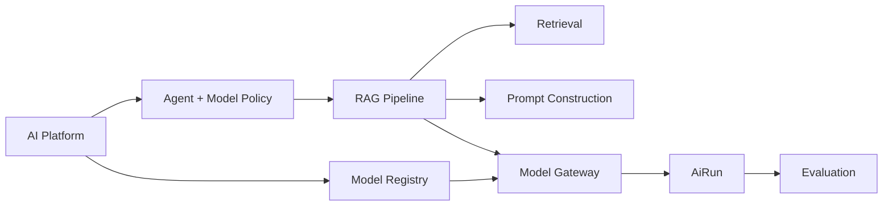
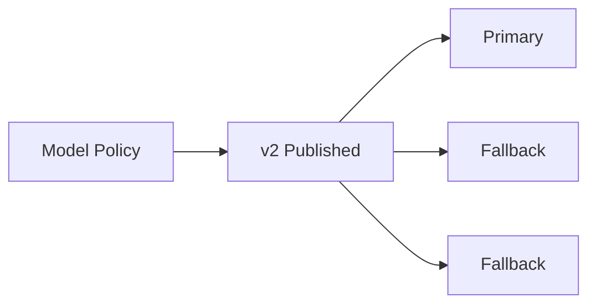
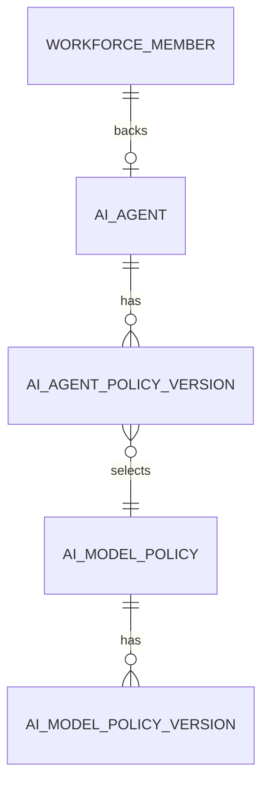
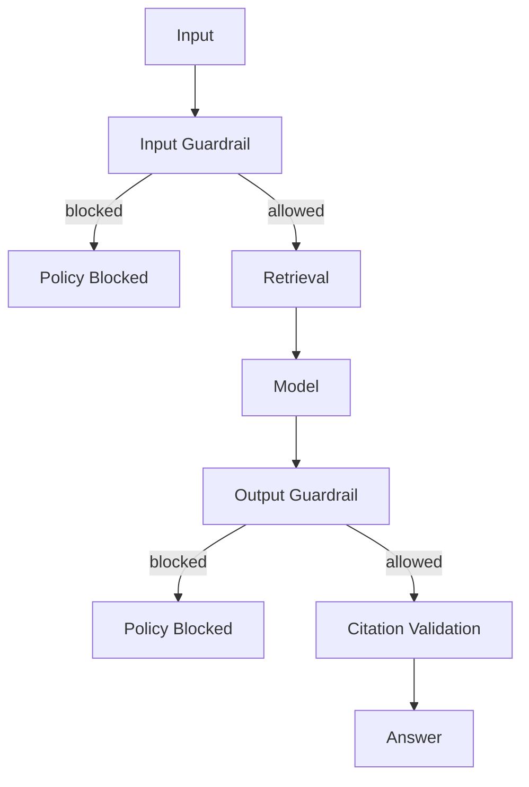
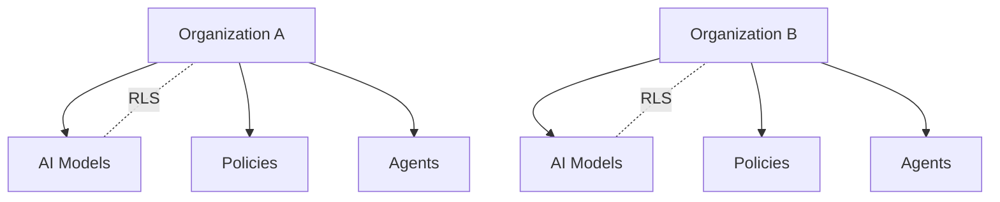
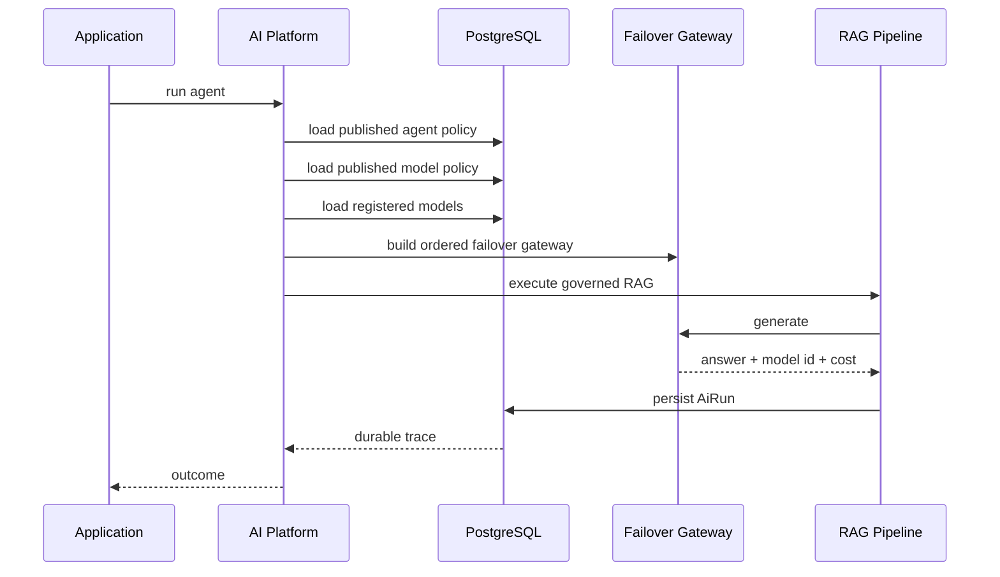

# Phase 6 — AI Platform

> Status: Implemented vertical slice

Phase 6 adds an AI control plane around the existing RAG pipeline instead of replacing it.

```text
Agent policy
  -> Model policy
  -> Registered models
  -> Guardrails
  -> Existing RAG pipeline
  -> Durable AiRun
  -> Cost + policy trace
  -> Evaluation
```

## 1. Platform versus pipeline



The RAG pipeline remains responsible for grounded retrieval, citations, answers, and handoff behavior. The platform controls which agent configuration and registered models may be used.

## 2. Model registry

`ai_models` records the provider/model pair and operational metadata:

```text
provider
model
credential_ref
base_url
input_cost_per_million
output_cost_per_million
capabilities
status
```

`credential_ref` is a secret reference. Provider credentials are not stored in the database.

Current production resolver support is Anthropic. New providers should implement the resolver contract instead of expanding the application service with provider-specific branches.

## 3. Model policies

Model policies are ordered fallback chains.



The failover gateway skips disabled models and stops after the configured fallback budget.

On success it returns the registered model identity and calculates cost from the registry pricing.

## 4. AI agents

An AI agent is an AI workforce member plus a versioned execution policy.



An agent policy controls:

```text
model policy
prompt version
autonomy
retrieval K
minimum retrieval coverage
history window
max output tokens
input/output guardrails
```

## 5. Autonomy boundary

Supported modes are:

```text
assist
copilot
autonomous
approval-gated
disabled
```

The current automatic execution service only accepts `autonomous`.

This prevents an endpoint call from silently escalating an assist/copilot agent into autonomous behavior.

## 6. Guardrails



Current deterministic checks:

```text
maximum input characters
maximum output characters
blocked input regex patterns
blocked output regex patterns
```

These are policy gates, not a complete AI safety system. They do not prove truthfulness, semantic safety, privacy compliance, or domain correctness.

## 7. Durable AI run trace

Governed runs persist:

```text
agent id
agent policy version
model registry id
provider
model
prompt version
retrieved chunks
input/output tokens
latency
cost
outcome
handoff reason
```

That makes model and policy changes auditable without depending on transient logs.

## 8. Cost attribution

```text
input cost  = input tokens / 1,000,000 × registered input price
output cost = output tokens / 1,000,000 × registered output price
total       = input cost + output cost
```

Costs are normalized to eight decimal places before persistence so memory and PostgreSQL results are deterministic.

## 9. Evaluation

Evaluation records are separate from `AiRun` records.

Supported evaluator types:

```text
RULE
HUMAN
MODEL
```

The built-in rule evaluator measures evidence characteristics rather than factual truth:

```text
answered
retrieved evidence present
cited evidence present
citation coverage
stale/error state
```

## 10. Tenant isolation

Models, model policies, agents, agent policies, evaluations, and AI runs are organization-owned.



Cross-tenant identifiers are not sufficient to access AI configuration.

## 11. Secret boundary

```text
database: credential_ref = ANTHROPIC_PRIMARY_KEY
runtime:  process.env.ANTHROPIC_PRIMARY_KEY
```

Never persist provider API keys or OAuth refresh tokens in AI configuration tables.

## 12. Execution flow



## 13. API surface

```text
GET/POST /api/v1/ai/models
PUT      /api/v1/ai/models/{id}/status
GET/POST /api/v1/ai/model-policies
GET/POST /api/v1/ai/agents
GET/POST /api/v1/ai/agents/{id}/policies
POST     /api/v1/ai/agents/{id}/run
GET      /api/v1/ai-runs/{id}
GET/POST /api/v1/ai-runs/{id}/evaluations
POST     /api/v1/ai-runs/{id}/evaluate
```

Configuration uses the dedicated `ai.manage` permission.

## 14. Testing

Phase 6 tests cover:

```text
guardrail blocking
model failover
model registry cost calculation
agent/model policy versioning
durable run traceability
policy-blocked handoff
deterministic evaluation
memory store
PostgreSQL store
RLS and migration behavior
```

## 15. Deliberately deferred

```text
tool execution
tool permissions
long-running agent jobs
multi-agent orchestration
agent memory service
embedding provider registry
automatic quality-based model routing
Kafka/provider-specific worker infrastructure
```

Those should become separate vertical phases instead of being hidden inside the AI platform.

## 16. Engineering mental model

```text
Policy
  ↓
Model Registry
  ↓
Guardrails
  ↓
Existing RAG Pipeline
  ↓
Durable AiRun
  ↓
Evaluation
```

The AI platform constrains and traces execution. It does not replace the conversation and retrieval semantics already established.
