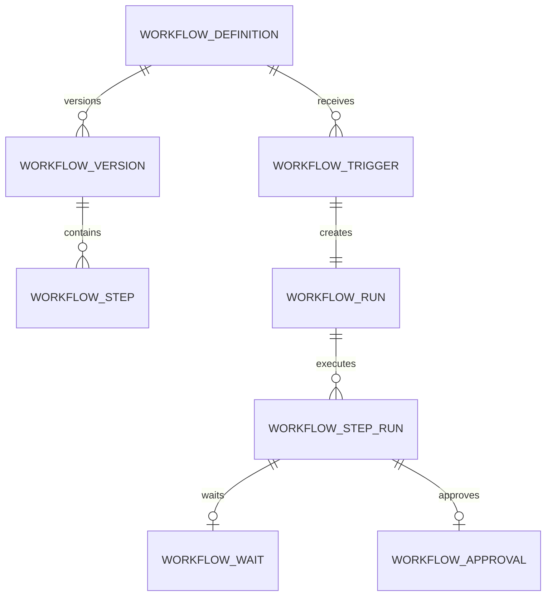
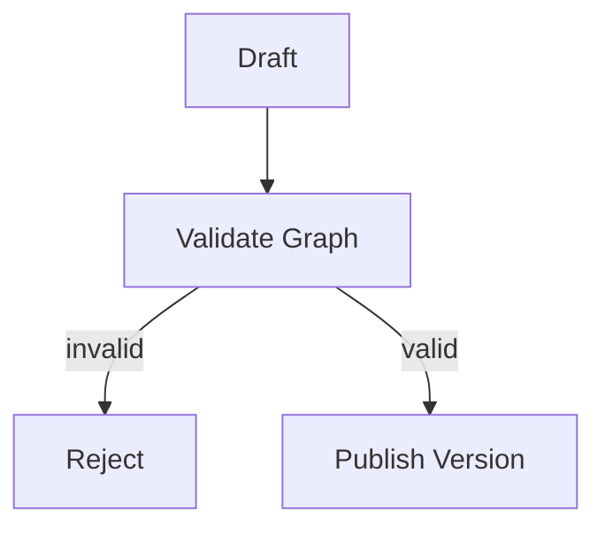
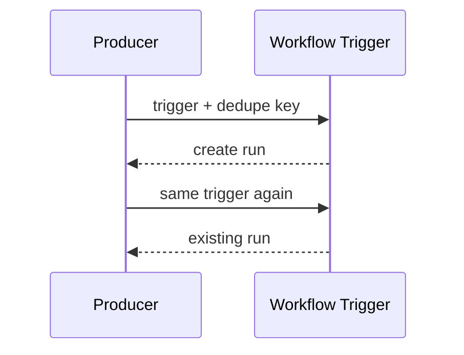
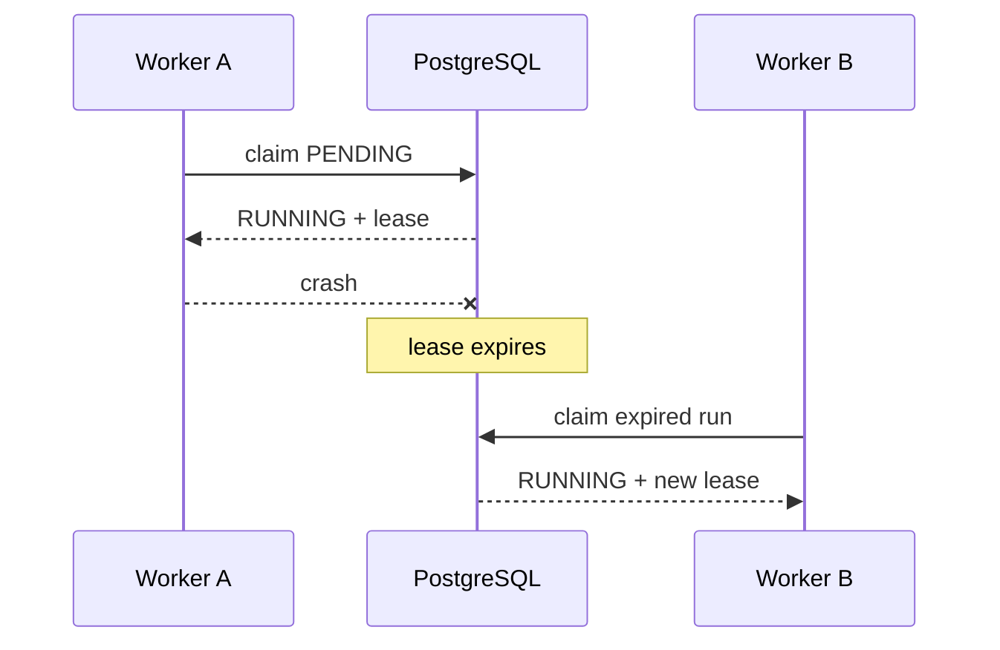
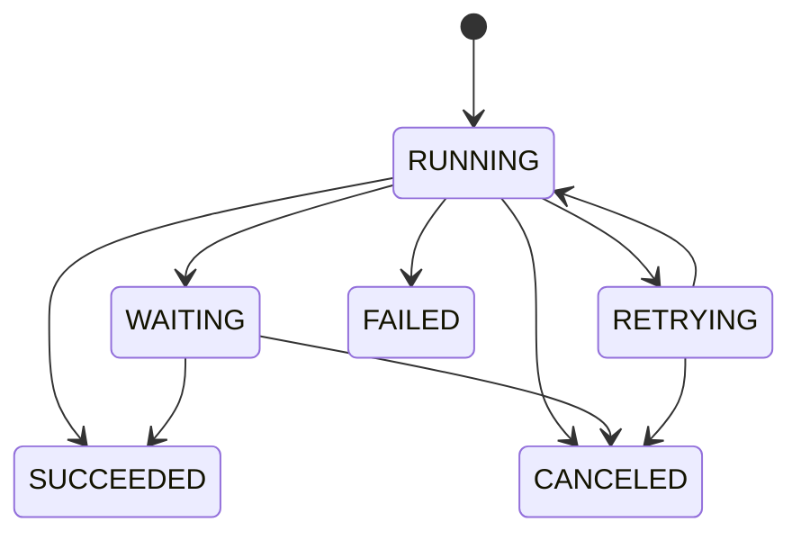
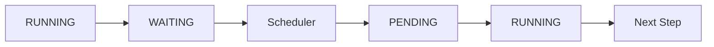
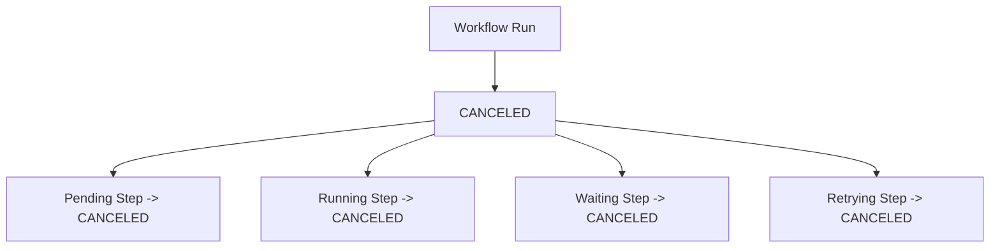
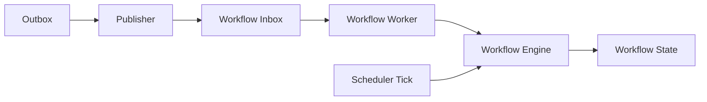

# Phase 7 — Workflow Engine

> Status: Implemented vertical slice

Phase 7 turns workflow definitions into a durable, resumable state machine.

```text
Definition
  -> immutable version
  -> explicit entry step
  -> idempotent trigger
  -> durable run
  -> durable step run
  -> worker lease
  -> success / wait / approval / retry / failure
  -> resume or terminal state
```

## 1. Relational execution model

Workflow identity, definitions, execution state, waits, and approvals are stored separately.



## 2. Explicit entry step

A workflow version stores entry_step_key. Execution never depends on database row order.

```text
entry_step_key -> step A -> step B -> terminal
```

## 3. Publication validation

Before publication the graph validator checks:

```text
unique step keys
valid entry step
valid next/failure/compensation references
no cycles
no unreachable nodes
at least one terminal step
supported step types
bounded retry policy
```



## 4. Trigger idempotency

A trigger is unique within an organization, workflow, and dedupe key.



The database uniqueness constraint is the final race-safety mechanism.

## 5. Run leasing

Workflow workers claim runs with a lease.



PostgreSQL uses FOR UPDATE SKIP LOCKED for concurrent run claiming.

## 6. Step state machine



Retry attempts are durable. When a RETRYING step is reclaimed, its attempt number advances before execution.

## 7. Current kernel step types

Phase 7 intentionally implements only:

```text
NOOP
WAIT
APPROVAL
COMPLETE
```

This proves the execution engine before irreversible external side effects are introduced.

## 8. WAIT

A WAIT step persists wake_at and releases the worker lease.



The original worker does not remain allocated while the workflow waits.

## 9. APPROVAL

Approval steps persist both the intended action and an action hash.

```text
action
  -> canonical hash
  -> approval record
  -> workflow WAITING
  -> human decision
```

Approval status supports:

```text
PENDING
APPROVED
REJECTED
EXPIRED
CANCELED
```

Approval resolution requires the dedicated workflow.approve permission.

## 10. Retry and failure branches

Each step stores retry_max_attempts, retry_backoff_seconds, on_failure_step_key, and compensation_step_key.

```text
attempt 1 -> failure -> RETRYING
backoff expires
attempt 2 -> success -> next step
```

After retry exhaustion the engine follows on_failure_step_key when configured; otherwise the run becomes FAILED.

Compensation execution is persisted as a future hook but is deliberately deferred until side-effecting steps exist.

## 11. Cancellation

Canceling a workflow run is authoritative and cancels active step runs.



Terminal runs remain terminal.

## 12. Worker integration

Phase 7 uses the Phase 5 worker runtime.



The scheduler separately resumes due waits and expires stale approvals.

## 13. Tenant isolation

Every workflow state table carries organization_id and is protected with PostgreSQL RLS.

```text
workflow_definitions
workflow_versions
workflow_steps
workflow_triggers
workflow_runs
workflow_step_runs
workflow_waits
workflow_approvals
```

## 14. API surface

```text
GET  /api/v1/workflows
POST /api/v1/workflows/versions
GET  /api/v1/workflows/{workflowId}/versions
POST /api/v1/workflows/{workflowId}/versions/{versionId}/publish
POST /api/v1/workflows/{workflowId}/start
GET  /api/v1/workflow-runs/{runId}
GET  /api/v1/workflow-runs/{runId}/steps
POST /api/v1/workflow-runs/{runId}/cancel
GET  /api/v1/workflow-approvals
POST /api/v1/workflow-approvals/resolve
```

Workflow configuration uses workflow.manage. Approval decisions use workflow.approve.

## 15. What Phase 7 proves

```text
duplicate trigger -> same run
worker crash -> lease recovery
step failure -> durable retry
retry backoff -> delayed retry
wait -> scheduler resume
approval -> human-controlled continuation
cancel -> authoritative termination
invalid graph -> publication rejection
```

## 16. Deliberately deferred

```text
external HTTP/action steps
tool execution
delivery actions
parallel branches
fan-out/fan-in
compensation execution
distributed cron
multi-region workflow execution
```

These should be separate implementation phases, not hidden inside the initial workflow kernel.

## 17. Engineering mental model

```text
Workflow Definition
      ↓
Version
      ↓
Trigger
      ↓
Run
      ↓
Step Run
      ↓
Success | Wait | Approval | Retry | Failure
      ↓
Resume / Next Step / Terminal State
```
