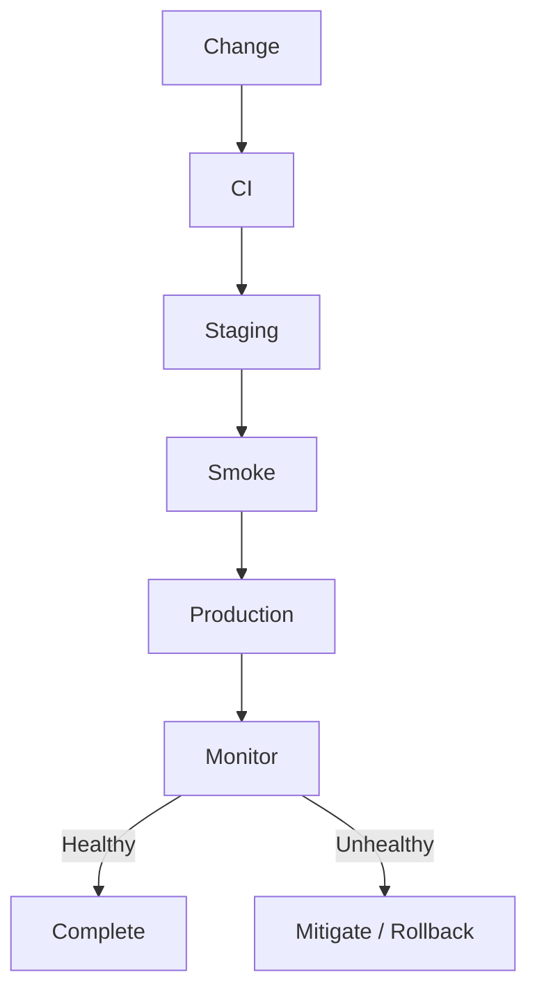

# Release Process

> Status: **Target / normative engineering design**.

Production releases are controlled changes with validation and rollback awareness.

## Contract

Pipeline: install from lockfile -> lint/format -> typecheck -> tests -> build immutable artifact -> migration compatibility -> staging -> smoke tests -> production -> monitor. Rollback must respect database compatibility; disablement/forward fix can be safer than blind code rollback.

## Mermaid Flow

## Engineering Rule

The design must fail closed on authorization, preserve tenant scope, make retries safe, and expose enough telemetry to diagnose production behavior.
