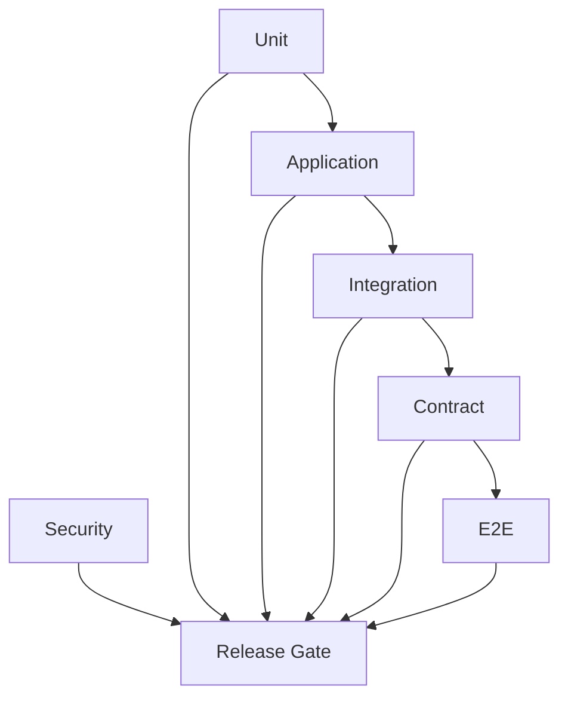

# Testing Policy

> Status: **Target / normative engineering design**.

Testing is organized around risk, not a vanity coverage number.

## Contract

Use unit tests for policies/domain logic, application tests for transactions, integration tests for DB/queues/providers, contract tests for APIs/webhooks, E2E tests for critical journeys, and security tests for isolation/signatures/privilege/secret redaction. Critical suites cover messaging, AI tools, billing, workflows and tenant isolation.

## Mermaid Flow

## Engineering Rule

The design must fail closed on authorization, preserve tenant scope, make retries safe, and expose enough telemetry to diagnose production behavior.
