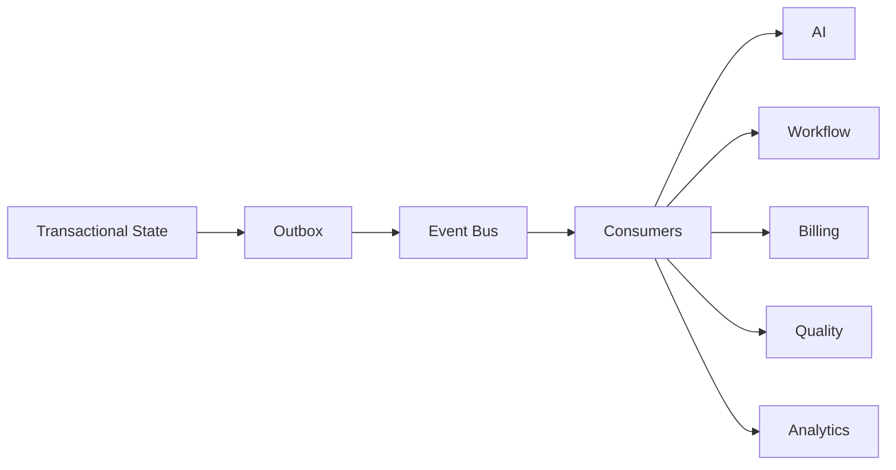

# Event Catalog

> Status: **Target / normative engineering design**.

Events are durable contracts around business state changes, asynchronous work and integrations. Delivery is at least once.

## Canonical Events

| Event | Producer | Main consumers |
|---|---|---|
| organization.created | tenancy | provisioning, audit |
| membership.changed | identity | authorization, notifications |
| customer.created | customers | analytics, CRM |
| conversation.created | conversations | routing, analytics |
| conversation.message.received | conversations/integrations | routing, AI, notifications |
| conversation.message.sent | conversations | delivery, analytics, billing |
| conversation.assignment.changed | workforce/routing | SLA, workforce |
| ai.run.completed | AI runtime | quality, analytics, usage |
| tool.invocation.completed | tools | audit, billing, analytics |
| workflow.run.completed | workflows | automation chaining |
| quality.evaluation.completed | quality | remediation, analytics |
| subscription.changed | billing | entitlement refresh |
| usage.recorded | billing | metering, finance |
| integration.webhook.received | integrations | normalization |

## Event Envelope

Required envelope fields:

- `event_id` — globally unique event identifier.
- `event_type` — stable semantic event name.
- `version` — event schema version.
- `occurred_at` — business occurrence time.
- `organization_id` — tenant scope when applicable.
- `actor` — human, service, system or provider context.
- `correlation_id` — end-to-end trace.
- `causation_id` — triggering event/request.
- `data` — typed business payload.
- `metadata` — bounded diagnostic metadata.

## Rules

- Do not publish credentials or unnecessary raw provider payloads.
- Preserve tenant scope.
- Publish only after the source transaction commits.
- Consumers must be idempotent.
- Database table names are not event semantics.
- Version changes when field meaning changes.

## Mermaid Flow

