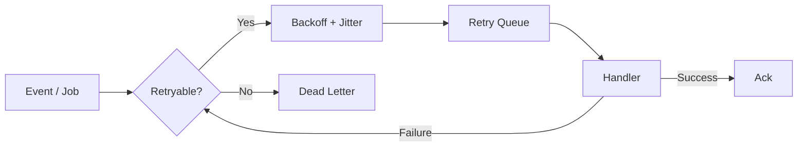

# Event and Job Retry Policy

> Status: **Target / normative engineering design**.

## Retry Classes

| Failure | Retry | Handling |
|---|---:|---|
| Network timeout | Yes | Exponential backoff + jitter |
| HTTP 429 | Yes | Respect provider retry window |
| Temporary database/network failure | Yes | Bounded retry |
| Invalid schema | No | Quarantine/dead-letter |
| Authorization failure | Usually no | Repair credential/policy then resume |
| Deterministic business conflict | No | Record conflict and action path |
| Unknown exception | Limited | Retry, alert, then dead-letter |

## Policy

Retry delays increase with attempt count and include jitter. Long retry delays must use scheduled retry state instead of blocking worker threads.

Every retryable side effect must have an idempotency design. Replay cannot assume the earlier attempt had no effect.

## Dead Letters

A dead-letter record contains event/job ID, organization, handler, handler version, attempt count, last error, timestamps and replay status. Replay creates a new attempt chain without erasing the original history.

## Poison Protection

Deterministic failures stop consuming worker capacity indefinitely. The failed item is isolated so healthy traffic continues.

## Mermaid Flow

