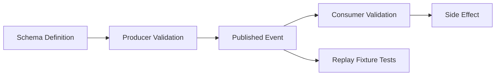

# Event Schema Directory

> Status: **Target / normative engineering design**.

Store versioned schemas using `<event-name>.v<version>.json`.

## Rules

- Required fields are explicit.
- Tenant-owned events carry organization scope.
- Additive changes are preferred within a version.
- Removed or reinterpreted fields require a new version.
- Consumers may allow additive metadata when forward compatibility is intended.
- Secrets and unnecessary raw provider payloads are excluded.
- Producers and consumers test representative fixtures.

## Priority Schemas

1. `conversation.message.received.v1.json`
2. `conversation.message.sent.v1.json`
3. `ai.run.completed.v1.json`
4. `workflow.run.completed.v1.json`
5. `subscription.changed.v1.json`
6. `usage.recorded.v1.json`

## Mermaid Lifecycle

