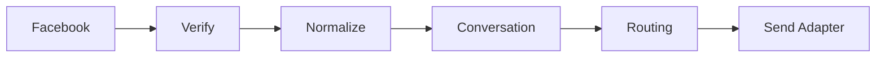

# Facebook Messenger Integration

> Status: **Target / normative engineering design**.

Use Page-scoped configuration and canonical conversations while retaining Facebook page/thread/message identifiers for reconciliation.

## Contract

Invalid webhook verification produces no mutation. Outbound failures update delivery state instead of rewriting message history.

## Mermaid Flow

## Engineering Rule

External inputs are untrusted, tenant scope is mandatory, and side effects require explicit authorization and idempotency where duplicate execution could matter.
