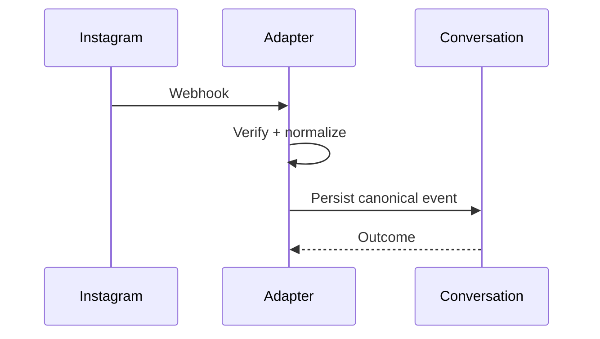

# Instagram Integration

> Status: **Target / normative engineering design**.

Map Instagram business identities and message threads to the canonical CustomerIdentity and Conversation model.

## Contract

Business/page credentials stay server-side. Webhook events are verified before normalization. Provider retries are expected and must be idempotent.

## Mermaid Flow

## Engineering Rule

External inputs are untrusted, tenant scope is mandatory, and side effects require explicit authorization and idempotency where duplicate execution could matter.
