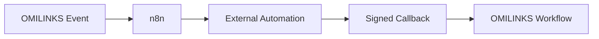

# n8n Integration

> Status: **Target / normative engineering design**.

Integrate n8n for external automation while OMILINKS remains authoritative for customers, conversations, authorization, and billing.

## Contract

n8n-triggered actions call the same application services used by first-party UI. Inbound callbacks are authenticated, correlated, and replay-safe.

## Mermaid Flow

## Engineering Rule

External inputs are untrusted, tenant scope is mandatory, and side effects require explicit authorization and idempotency where duplicate execution could matter.
