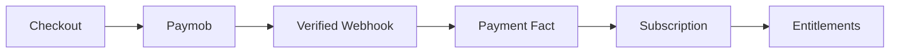

# Paymob Integration

> Status: **Target / normative engineering design**.

Implement payment creation, verified server-side webhook processing, subscription transition, reconciliation, and entitlement refresh.

## Contract

Browser redirects never become authoritative payment proof. Payment webhook effects are idempotent by provider transaction/event identifier.

## Mermaid Flow

## Engineering Rule

External inputs are untrusted, tenant scope is mandatory, and side effects require explicit authorization and idempotency where duplicate execution could matter.
