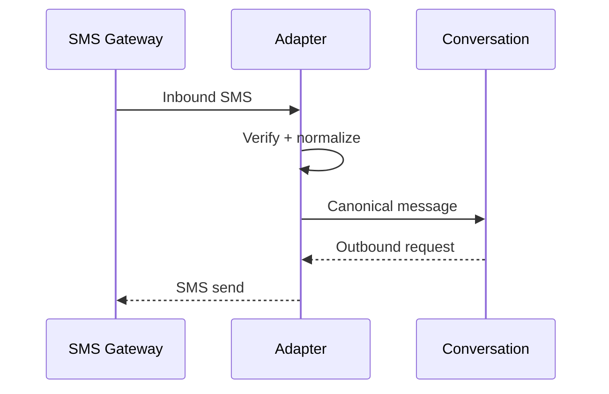

# SMS Integration

> Status: **Target / normative engineering design**.

Treat SMS as a first-class channel with phone-number identity and delivery receipts.

## Contract

Phone matching is tenant-scoped and ambiguous identity matches are not auto-merged. Segmenting and gateway-specific behavior remain adapter concerns.

## Mermaid Flow

## Engineering Rule

External inputs are untrusted, tenant scope is mandatory, and side effects require explicit authorization and idempotency where duplicate execution could matter.
