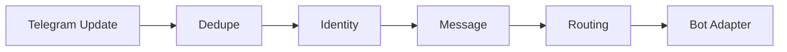

# Telegram Integration

> Status: **Target / normative engineering design**.

Normalize Telegram bot updates, users, chats, and media into channel-neutral conversation facts.

## Contract

Store update IDs for dedupe. Bot credentials are server-side and can be rotated independently.

## Mermaid Flow

## Engineering Rule

External inputs are untrusted, tenant scope is mandatory, and side effects require explicit authorization and idempotency where duplicate execution could matter.
