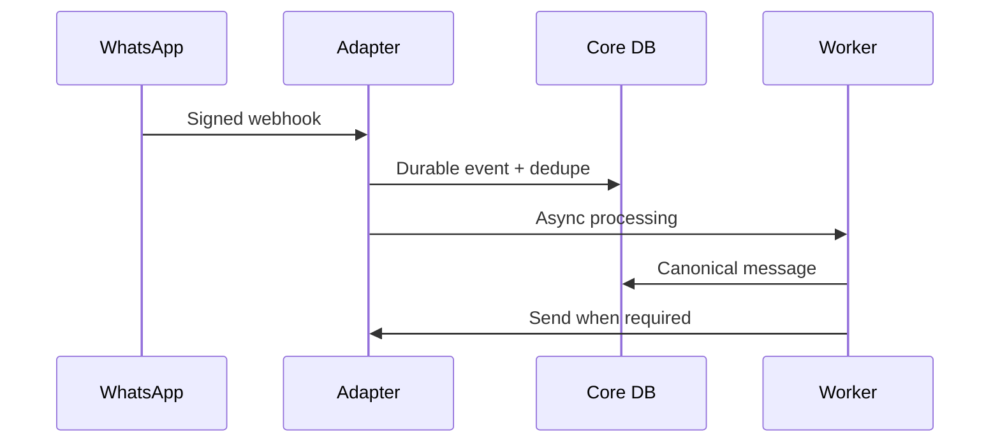

# WhatsApp Integration

> Status: **Target / normative engineering design**.

Normalize verified WhatsApp events into canonical customer, conversation, message, attachment, and delivery facts. Keep provider identifiers alongside internal IDs.

## Contract

Webhook verification -> durable ingest -> normalize -> route -> human/AI -> send -> delivery status

Provider outage must degrade only WhatsApp, not the whole conversation system.

## Mermaid Flow

## Engineering Rule

External inputs are untrusted, tenant scope is mandatory, and side effects require explicit authorization and idempotency where duplicate execution could matter.
