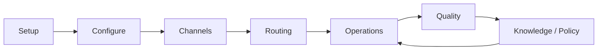

# UX Flows

> Status: **Target / normative engineering design**.

The operations UX must make work, ownership, AI control and failure state obvious.

## Contract

BPO setup: organization -> client -> program -> sector/team -> channels -> workforce -> routing. Conversation: inbound -> queue -> human/AI -> knowledge/tools -> outbound -> resolution -> QA. AI handoff: policy/low confidence -> stop autonomous send -> assign human -> preserve context. Billing: checkout -> verified payment -> subscription -> entitlements.

## Mermaid Flow

## Engineering Rule

The design must fail closed on authorization, preserve tenant scope, make retries safe, and expose enough telemetry to diagnose production behavior.
