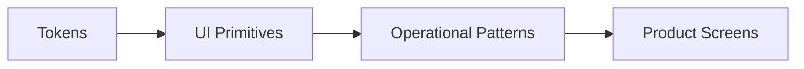

# Design System

> Status: **Target / normative engineering design**.

The console is an operational product: readability, state clarity and fast action outrank decorative complexity.

## Contract

Use semantic design tokens for background, foreground, muted text, border, focus, destructive, success, warning and info. Shared primitives include Button/Input/Dialog/Table/Badge/Toast/Skeleton; operational patterns include ConversationTimeline, AssignmentPicker, AIStatus, WorkflowRunStatus and IntegrationHealth. Target WCAG 2.2 AA practices.

## Mermaid Flow

## Engineering Rule

The design must fail closed on authorization, preserve tenant scope, make retries safe, and expose enough telemetry to diagnose production behavior.
