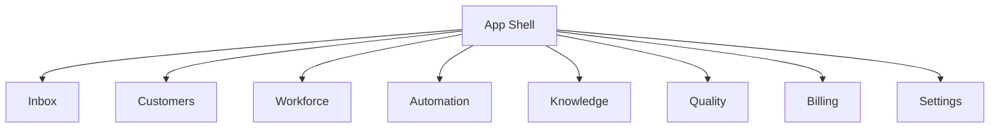

# Screen Specifications

> Status: **Target / normative engineering design**.

Every operational screen defines its complete UI state, not only the success state.

## Contract

Core screens: Inbox, Customer, Workforce, Automation, Knowledge, Quality, Analytics, Billing, Settings. Data-heavy screens must define loading, empty, error, forbidden, stale, partial and success states. Static demo data must never masquerade as live production data.

## Mermaid Flow

## Engineering Rule

The design must fail closed on authorization, preserve tenant scope, make retries safe, and expose enough telemetry to diagnose production behavior.
