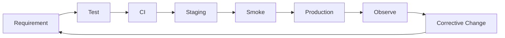

# Acceptance Criteria

> Status: **Target / normative engineering design**. This document defines behavior and implementation constraints even when the current code has not implemented the subsystem yet.

## Purpose

Acceptance criteria are the release gate for OMILINKS behavior. A feature is not complete because its UI works; the underlying invariants, failures, authorization, observability, and contracts must also hold.

## Definition of Done

1. Domain behavior is documented.
2. API/event contracts are updated when observable behavior changes.
3. Tenant isolation and authorization are tested, including negative tests.
4. Retry, timeout, provider failure, and concurrency behavior are covered.
5. Relevant metrics/logs/traces exist.
6. Protected mutations are auditable.
7. Database migration and rollback strategy are understood.
8. CI passes all applicable checks.

## Critical Criteria

| ID | Requirement |
|---|---|
| AC-001 | Cross-tenant reads/writes/exports always fail regardless of valid resource UUID. |
| AC-002 | Membership roles are organization-scoped; no global user role grants access. |
| AC-003 | Replayed provider webhook does not create duplicate business state. |
| AC-004 | Routing evaluates only policies effective for the conversation scope. |
| AC-005 | AI cannot invoke an unregistered or unauthorized tool. |
| AC-006 | Knowledge retrieval cannot return another tenant's chunk. |
| AC-007 | Human takeover blocks autonomous AI sends until explicitly released. |
| AC-008 | Workflow execution survives worker restart. |
| AC-009 | Entitlement enforcement is backend-authoritative. |
| AC-010 | Invalid webhook signature causes no business mutation. |
| AC-011 | Protected state changes identify actor, tenant, resource, action, time, outcome. |
| AC-012 | Release smoke tests cover health, auth, core customer/conversation flow, and monitoring. |

## Critical Journey

Customer message -> signed webhook -> durable ingest -> routing -> human/AI execution -> optional tool/knowledge use -> outbound send -> delivery update -> quality/analytics/billing events.

## Mermaid System View

## Change Rule

Changes that alter these contracts must update the affected requirement, API/event contract, tests, and this document. Security and tenant-isolation constraints cannot be weakened for implementation convenience.
