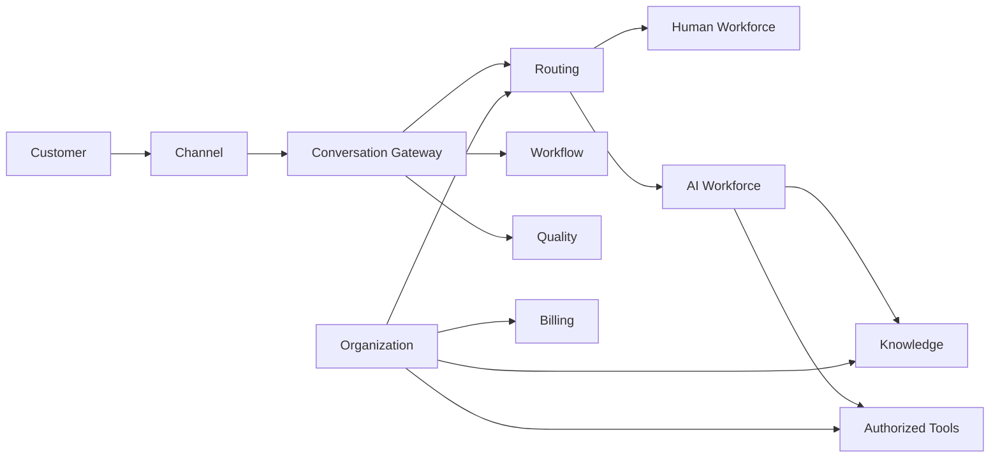

# Functional Requirements

> Status: **Target / normative engineering design**. This document defines behavior and implementation constraints even when the current code has not implemented the subsystem yet.

## Purpose

OMILINKS provides one operational system for businesses and BPO/service providers: customer conversations, human and AI workforce, channels, knowledge, authorized actions, workflows, quality, analytics, billing, and integrations.

## Tenant and Organization

An Organization is the hard tenant boundary. BPO organizations may have Client Accounts, Programs, Sectors, Teams, and Sites. Direct businesses may operate without the Client Account layer. Every tenant-owned object resolves to exactly one organization.

## Customer Operations

Customers have canonical identities plus channel-specific identities. Conversations contain participants, immutable message history, assignments, delivery state, tags, and operational status. Provider IDs are stored as external identifiers, never as internal authority.

## Workforce

Human and AI workforce members share common assignment/capacity concepts, while authorization remains independent. Routing chooses an eligible workforce member/queue; it does not grant permissions.

## AI and Knowledge

AI agents are explicitly configured with model policy, context policy, tools, budgets, and guardrails. Retrieval is tenant- and permission-scoped. AI may propose actions but domain services validate all state-changing operations.

## Workflows and Quality

Workflows are durable state machines with retries/timers/approvals. Quality uses versioned scorecards and evidence. Analytics consume durable facts rather than becoming a competing source of truth.

## Billing

Plan, Entitlement, Subscription, Usage, Invoice, and Payment are modeled explicitly. Backend entitlements are authoritative. Payment state changes only from verified server-side processing.

## Cross-Cutting

Every external callback is authenticated and idempotent. Significant mutations are auditable. Every long-running operation is observable. No frontend state is an authorization decision.

## Mermaid System View

## Change Rule

Changes that alter these contracts must update the affected requirement, API/event contract, tests, and this document. Security and tenant-isolation constraints cannot be weakened for implementation convenience.
