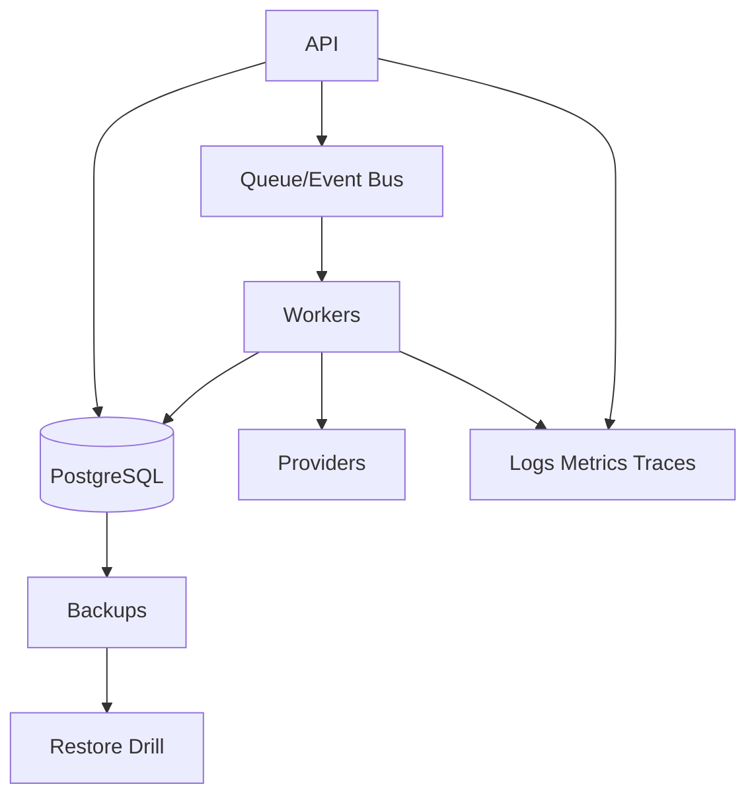

# Non-Functional Requirements

> Status: **Target / normative engineering design**. This document defines behavior and implementation constraints even when the current code has not implemented the subsystem yet.

## Purpose

OMILINKS must be secure, observable, horizontally scalable, recoverable, maintainable, and predictable under external provider failure.

## Performance Targets

| Path | Target |
|---|---|
| Authenticated CRUD API | p95 < 300 ms excluding long-running exports/AI |
| Webhook acknowledgement | target < 2 s after durable acceptance |
| Routing decision | p95 < 150 ms on warm path |
| AI first token | target p95 < 4 s, measured separately from provider latency |
| Health endpoint | < 1 s |

## Availability

Design the core API for 99.9% monthly availability. Channel providers are independently degraded and must not bring down the whole platform.

## Consistency

Transactional business state is strongly consistent. Events and indexes are eventually consistent and delivered at least once, so consumers must be idempotent.

## Security

TLS in transit, encrypted secrets, least-privilege machine identities, tenant isolation, authorization on every protected use case, secret redaction, and auditability for protected changes.

## Observability

Every request, webhook, conversation message, workflow run, AI run, and background job carries correlation identifiers. Metrics distinguish operation, tenant, provider, model, and outcome.

## Recovery

Define RPO/RTO per deployment tier and prove restore procedures through drills. External provider state must be reconciled after database recovery.

## Accessibility

The operations console targets WCAG 2.2 AA practices: keyboard operation, semantic labels, focus visibility, sufficient contrast, and non-color status cues.

## Mermaid System View

## Change Rule

Changes that alter these contracts must update the affected requirement, API/event contract, tests, and this document. Security and tenant-isolation constraints cannot be weakened for implementation convenience.
