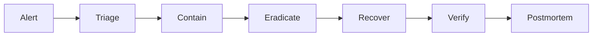

# Incident Response

> Status: **Target / normative engineering design**.

Incidents use a repeatable lifecycle: detect, classify, contain, eradicate, recover, verify, learn.

## Contract

SEV-1 covers active breach, broad outage or major integrity impact; SEV-2 material degradation/contained security issue; SEV-3 limited defect. Preserve correlation IDs, audit events, provider event IDs and deployment versions. Corrective actions become tracked engineering work.

## Mermaid Flow

## Engineering Rule

The design must fail closed on authorization, preserve tenant scope, make retries safe, and expose enough telemetry to diagnose production behavior.
