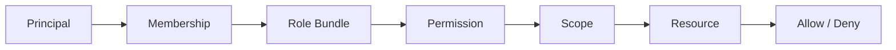

# Permission Matrix

> Status: **Target / normative engineering design**.

Permissions are explicit capabilities. Roles are bundles; scope determines where the capability applies.

## Contract

`| Capability | Owner | Admin | Supervisor | Agent | QA | AI |
|---|---|---|---|---|---|---|
| Org settings | Yes | Yes | No | No | No | No |
| Members | Yes | Yes | No | No | No | No |
| Customer read | Yes | Yes | Yes | Scoped | Scoped | Scoped |
| Conversation send | Yes | Yes | Yes | Yes | No | Policy |
| Assignment | Yes | Yes | Yes | No | No | Policy |
| AI config | Yes | Yes | Scoped | No | No | No |
| Billing | Yes | Scoped | No | No | No | No |
`

Service identities receive operation-specific permissions and never inherit human administrator access.

## Mermaid Flow

## Engineering Rule

The design must fail closed on authorization, preserve tenant scope, make retries safe, and expose enough telemetry to diagnose production behavior.
