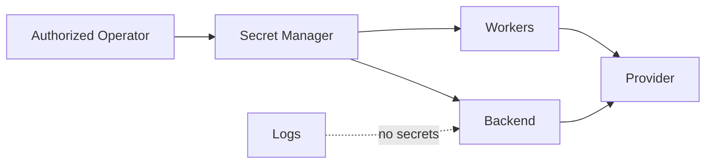

# Secrets Management

> Status: **Target / normative engineering design**.

Provider credentials, database credentials, signing keys, encryption keys and token material are secret assets.

## Contract

Use runtime secret injection or a secret manager. Never place raw secrets in source, client bundles, Git, logs, telemetry, event payloads, or error messages. Every credential has owner, purpose, rotation, expiry metadata where possible, and revocation procedure.

## Mermaid Flow

## Engineering Rule

The design must fail closed on authorization, preserve tenant scope, make retries safe, and expose enough telemetry to diagnose production behavior.
