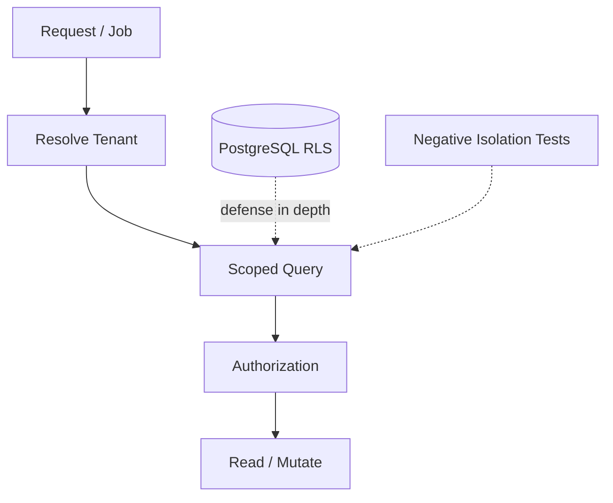

# Tenant Isolation

> Status: **Target / normative engineering design**.

Tenant isolation is a correctness property, not merely a security feature. UUID uniqueness does not authorize access.

## Contract

Resolve organization before resource access; require tenant scope in repository/data APIs; enforce ownership foreign keys; optionally use PostgreSQL RLS as defense in depth; carry tenant context into jobs/events; test cross-tenant reads, writes, exports and replays. Never use unscoped getById as the normal repository contract.

## Mermaid Flow

## Engineering Rule

The design must fail closed on authorization, preserve tenant scope, make retries safe, and expose enough telemetry to diagnose production behavior.
