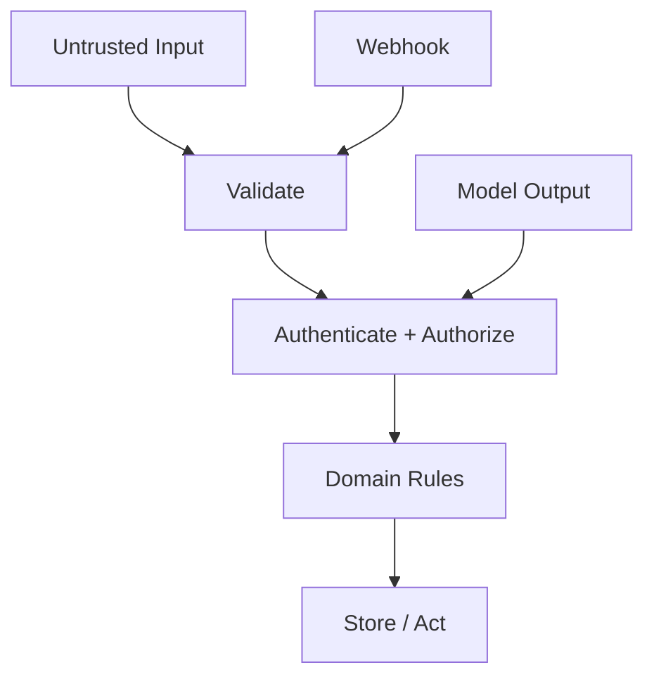

# Threat Model

> Status: **Target / normative engineering design**.

Security assets are customer data, tenant boundaries, credentials, AI policy, billing state, and audit history.

## Contract

`| Threat | Primary control |
|---|---|
| Cross-tenant access | Tenant-scoped queries + negative tests |
| Credential theft | Secret manager + rotation |
| Webhook spoofing | Signature verification |
| Prompt injection | Untrusted context + tool policy |
| AI exfiltration | Scoped retrieval + output controls |
| Duplicate side effects | Idempotency |
| Privilege escalation | Explicit permission checks |
| Supply-chain risk | Lockfiles + CI review |
`

Lower-trust input can never become a higher-trust authority.

## Mermaid Flow

## Engineering Rule

The design must fail closed on authorization, preserve tenant scope, make retries safe, and expose enough telemetry to diagnose production behavior.
